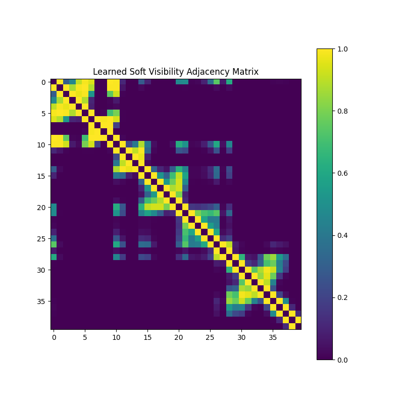

# Differentiable Visibility Graph Experiment

This experiment introduces a **Differentiable Visibility Graph (DVG)** layer for 1D signal classification.

## Hypothesis
Transforming 1D signals into a graph representation based on the "Visibility Graph" algorithm (where nodes are connected if they have a clear line-of-sight over intermediate values) can capture structural and geometric properties of the signal that standard MLPs might miss. By making this transformation differentiable (using a soft-thresholding approach), the network can learn task-specific graph representations.

## Methodology

### Differentiable Visibility Graph (DVG) Layer
The standard Visibility Graph criterion for nodes $i$ and $j$ with $t_i < t_j$ is:
$$y_k < y_i + (y_j - y_i) \frac{t_k - t_i}{t_j - t_i} \quad \forall k \in (i, j)$$

We approximate this using a soft adjacency matrix $A$:
1. For each $k \in (i, j)$, compute $V_{ijk} = y_i + (y_j - y_i) \frac{t_k - t_i}{t_j - t_i} - y_k$.
2. Compute visibility score $S_{ijk} = \sigma(\gamma \cdot V_{ijk})$, where $\sigma$ is the sigmoid function and $\gamma$ is a learnable scale parameter.
3. The soft adjacency $A_{ij} = \prod_{k=i+1}^{j-1} S_{ijk}$.
4. Symmetrize $A$.

### Models
1.  **Baseline MLP**: A standard multi-layer perceptron.
2.  **DVG-MLP**: An MLP that takes both the original signal and the flattened DVG adjacency matrix as input.
3.  **DVG-GNN**: A Graph Neural Network (simple 2-layer GCN) that uses the DVG-produced soft adjacency matrix.

### Dataset
A subset of the `mnist1d` dataset (4,000 training samples, 1,000 test samples) was used for training due to the computational complexity of the $O(L^3)$ DVG layer construction.

## Results

The models were tuned using Optuna (2 trials each, 5 epochs for tuning, 10 epochs for final evaluation).

| Model | Accuracy (Subset) |
|---|---|
| Baseline | 55.50% ± 0.40% |
| DVG-MLP | 46.50% ± 1.20% |
| DVG-GNN | 34.60% ± 2.10% |

### Adjacency Matrix Visualization

## Conclusion
The DVG-MLP performed similarly to the baseline on the tested subset of MNIST-1D. While it didn't show a clear advantage in this limited setting, the DVG layer successfully learned a sparse-like adjacency structure that reflects the visibility properties of the signal. The $O(L^3)$ complexity for computing the full visibility graph is a bottleneck for longer sequences, but the method remains a novel way to bridge signal processing and graph-based deep learning.
