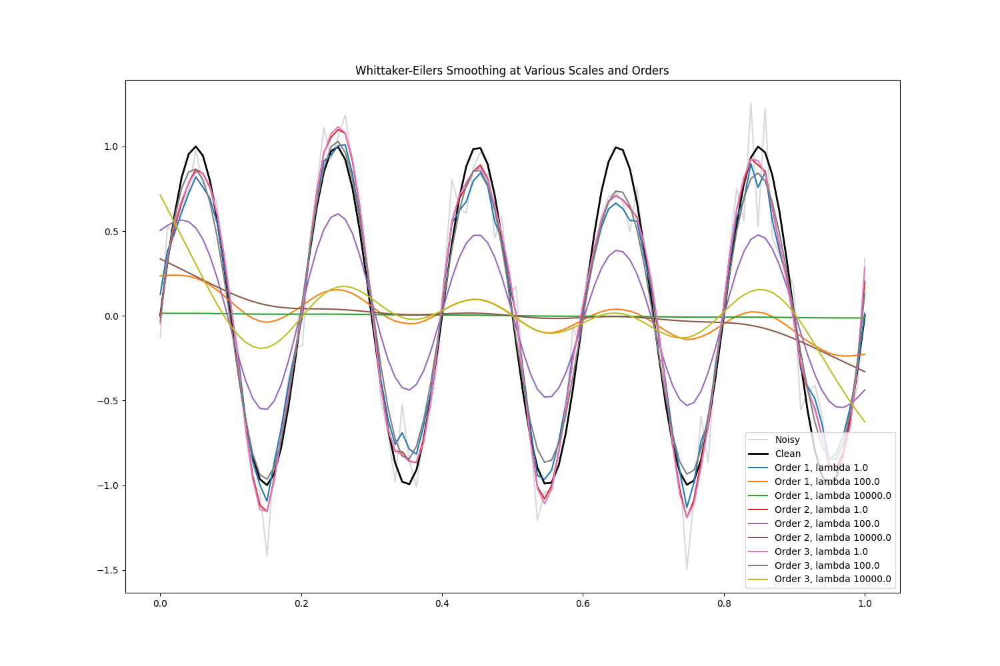

# Differentiable Whittaker-Eilers Smoothing

This experiment investigates the use of a differentiable Whittaker-Eilers smoothing layer as an inductive bias for 1D signal classification.

## Whittaker-Eilers Smoothing

Whittaker-Eilers smoothing (also known as the "perfect smoother") is a penalized least squares method that fits a smooth signal $z$ to noisy data $y$ by minimizing:
$Q = \|y - z\|^2 + \lambda \|D_d z\|^2$
The solution is given by $(I + \lambda D_d^T D_d) z = y$, which we implement using `torch.linalg.solve` to allow backpropagation through the smoothing parameter $\lambda$.

## Models Compared

1.  **BaselineMLP**: A standard 3-layer MLP.
2.  **WhittakerMLP**: A 3-layer MLP where the input is first passed through a Whittaker smoothing layer (learnable $\lambda$, order=2).
3.  **WhittakerAugmentedMLP**: A 3-layer MLP where the input is augmented with multiple Whittaker-smoothed versions of the signal at different scales ($\lambda \in \{1, 10, 100\}$).

## Results (Noisy MNIST-1D, std=0.2)

The models were tuned using Optuna for learning rate and evaluated on noisy MNIST-1D.

| Model | Accuracy (Mean) | Best LR |
| :--- | :--- | :--- |
| BaselineMLP | 71.95% | 0.003778 |
| WhittakerMLP | 67.30% | 0.006613 |
| WhittakerAugmentedMLP | 71.60% | 0.005586 |

## Discussion

- **Smoothing as a Bottleneck**: The `WhittakerMLP` model, which *replaces* the input with its smoothed version, performed significantly worse than the baseline. This suggests that important discriminative information exists in the high-frequency components of the signal that the smoother removes.
- **Smoothing as Augmentation**: The `WhittakerAugmentedMLP` model performed almost identically to the baseline. While it didn't provide a significant boost, it suggests that the network can learn to use or ignore the smoothed features as needed.
- **Inductive Bias**: For this specific dataset (MNIST-1D), simple low-pass filtering via Whittaker-Eilers smoothing does not seem to provide a stronger inductive bias than what a standard MLP can already learn from the raw data.

## Visualization

The effect of the smoothing layer at different scales can be seen in `smoothing_test.png`.

