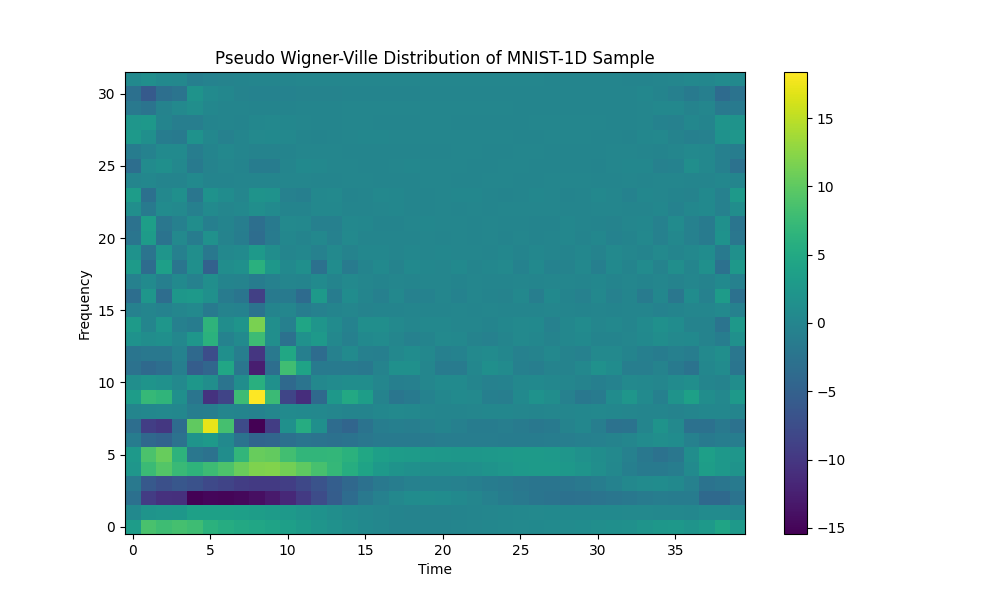

# Differentiable Wigner-Ville Distribution Experiment

This experiment investigates the effectiveness of using the Wigner-Ville Distribution (WVD) as a differentiable feature extraction layer for 1D signal classification on the `mnist1d` dataset.

## Method

The Wigner-Ville Distribution is a time-frequency representation that provides high resolution in both time and frequency domains. We implemented a **Differentiable Pseudo Wigner-Ville Distribution** layer:

1.  **Analytic Signal:** The input signal is converted to its analytic form using the Hilbert transform to avoid aliasing and spectral redundancy.
2.  **Instantaneous Autocorrelation (IA):** For each time point $n$, the IA is computed as $R[n, m] = z[n+m] \cdot z^*[n-m]$ where $z$ is the analytic signal and $m$ is the lag.
3.  **Windowing:** A Hamming window is applied to the IA in the lag dimension to suppress cross-term interference (resulting in the *Pseudo* WVD).
4.  **FFT:** A Fourier transform is applied over the lag dimension to obtain the time-frequency representation.

The layer is fully differentiable, allowing it to be integrated into end-to-end trainable neural networks.

## Models Compared

1.  **BaselineMLP:** A standard MLP acting directly on the raw 1D signal.
2.  **WVMLP:** An MLP that takes the flattened WVD as its input.
3.  **WVAugmentedMLP:** An MLP that takes the concatenation of the raw signal and the flattened WVD as its input.

All models were tuned for learning rate using Optuna to ensure a fair comparison.

## Results

The models were evaluated on the `mnist1d` dataset (10,000 samples). Results are reported as mean accuracy ± standard deviation over 3 seeds.

| Model | Test Accuracy | Best LR |
| :--- | :--- | :--- |
| **BaselineMLP** | 72.98% ± 0.50% | 0.0088 |
| **WVMLP** | 53.22% ± 1.23% | 0.00046 |
| **WVAugmentedMLP** | 82.30% ± 0.35% | 0.00032 |

## Conclusion

The results show that while the WVD features alone (`WVMLP`) are less effective than the raw signal for this specific task, **augmenting the raw signal with WVD features (`WVAugmentedMLP`) significantly improves performance** (from ~73.0% to ~82.3%).

This suggests that the Wigner-Ville Distribution captures useful time-frequency patterns that are not easily extracted by a simple MLP from the raw time-domain signal. The Pseudo WVD provides a beneficial inductive bias for the `mnist1d` classification task.

## Sample WVD Visualization

