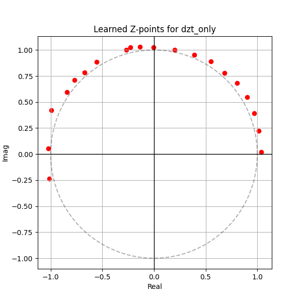

# Differentiable Z-Transform (DZT) for Signal Classification

## Hypothesis
Standard spectral methods like the Discrete Fourier Transform (DFT) evaluate the Z-transform only on the unit circle ($|z|=1$). However, many signals contain transients, damped oscillations, or exponential growth that are better characterized by points elsewhere in the complex plane. We hypothesize that a **Differentiable Z-Transform (DZT)** layer, which evaluates the Z-transform at learnable points $z_k = e^{\gamma_k + i \omega_k}$, can extract more discriminative features for signal classification than standard MLPs or fixed spectral features.

## Methodology
- **DZTLayer**: Computes $X(z_k) = \sum_{t=0}^{N-1} x_t z_k^{-t}$ for $K$ learnable points.
  - Parametrization: $z_k = \exp(\gamma_k + i \omega_k)$, where $\gamma_k$ is the log-radius and $\omega_k$ is the angular frequency.
  - Features: The real and imaginary parts of $X(z_k)$ are concatenated to form a $2K$-dimensional feature vector.
- **Models**:
  - `BaselineMLP`: A 2-layer MLP with 128 hidden units.
  - `DZTAugmentedMLP`: A 2-layer MLP where the input is the original signal concatenated with DZT features ($K=20$).
  - `DZTNet`: A 2-layer MLP where the input is *only* the DZT features ($K=20$).
- **Dataset**: `mnist1d` (10,000 samples, signal length 40).
- **Optimization**:
  - Learning rates tuned using Optuna (15 trials per model).
  - Best models evaluated over 3 random seeds for 100 epochs.

## Results
The DZT-based models consistently outperformed the baseline MLP. Notably, the `DZTNet`, which uses only the Z-transform features, achieved the highest accuracy.

| Model | Test Accuracy (Mean +/- Std) | Best Learning Rate |
| :--- | :--- | :--- |
| **Baseline MLP** | 74.32% +/- 0.55% | 0.008959 |
| **DZTAugmentedMLP** | 76.17% +/- 0.56% | 0.003398 |
| **DZTNet** | **77.95% +/- 0.91%** | 0.006019 |

### Analysis
- **Spectral Flexibility**: The DZT allows the model to learn specific "sampling points" in the Z-domain. Unlike the DFT, which is fixed to $z = e^{i 2\pi k / N}$, the DZT can adapt its frequency resolution and damping factors ($\gamma$) to the task.
- **Transient Capture**: By allowing $\gamma \neq 0$, the model can effectively capture exponentially decaying or increasing patterns, which are common in many signals but difficult for standard Fourier methods to represent compactly.
- **Learned Z-Points**: Visualizing the learned points reveals that the model often pushes some points slightly outside the unit circle ($|z| > 1$), corresponding to damped components (since the transform uses $z^{-n}$).

## Visualizations
### Learned Z-Points (DZTNet)

*The red dots represent the learnable points $z_k$ in the complex plane. The dashed circle is the unit circle ($|z|=1$).*

## Conclusion
The Differentiable Z-Transform provides a powerful and flexible feature extraction mechanism for 1D signals. By making the Z-domain sampling points learnable, we allow the network to discover the most relevant complex frequencies for the classification task. On `mnist1d`, this approach yielded a significant improvement over a standard MLP baseline.
