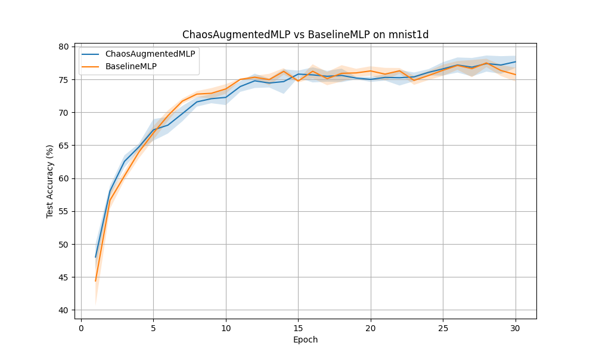

# Differentiable 0-1 Test for Chaos Experiment

## Hypothesis
The 0-1 test for chaos (Gottwald and Melbourne) is a binary test to distinguish between deterministic chaos and regular dynamics in a time series. It works by mapping the time series to a 2D Euclidean group and analyzing the growth of the mean square displacement (MSD) of the resulting trajectories. We hypothesize that a **Differentiable 0-1 Test for Chaos (D01Test)** layer, where the frequencies $c$ used for modulation are learnable parameters, can serve as a powerful feature extractor for identifying complex temporal patterns in 1D signals.

## Methodology

### 0-1 Test for Chaos
Given a time series $x(j)$ for $j=1, \dots, N$:
1.  Choose a frequency $c \in (0, \pi)$.
2.  Compute auxiliary variables:
    $p_c(n) = \sum_{j=1}^n x(j) \cos(jc)$
    $q_c(n) = \sum_{j=1}^n x(j) \sin(jc)$
3.  Compute the Mean Square Displacement (MSD):
    $M_c(n) = \frac{1}{N-n} \sum_{j=1}^{N-n} [ (p_c(j+n) - p_c(j))^2 + (q_c(j+n) - q_c(j))^2 ]$
    for $n = 1, \dots, n_{max}$.
4.  The modified MSD to account for drift is $D_c(n) = M_c(n) - (E[x])^2 \frac{1-\cos(nc)}{1-\cos(c)}$.
5.  The chaos statistic $K_c$ is defined as the correlation between $n = (1, 2, \dots, n_{max})$ and $D_c = (D_c(1), D_c(2), \dots, D_c(n_{max}))$.
    $K_c \approx 0$ indicates regular dynamics, while $K_c \approx 1$ indicates chaotic dynamics.

### Differentiable Implementation
-   The modulation $x(j) e^{ijc}$ and the sliding window sums used to compute $M_c(n)$ are implemented using PyTorch operations, making the entire process differentiable with respect to $x$ and $c$.
-   A `ZeroOneChaosLayer` can learn multiple frequencies $c_k$ to capture different aspects of the signal's dynamics.
-   The $K_c$ values for different frequencies are used as features for a downstream classifier.

### Experimental Setup
-   **Dataset**: MNIST-1D (10,000 samples).
-   **Models**:
    -   `BaselineMLP`: A standard 2-layer MLP on raw features (256 units).
    -   `ChaosAugmentedMLP`: An MLP that receives the concatenation of raw features (40) and 8 learned $K_c$ features.
-   **Hyperparameter Tuning**: Learning rates tuned via Optuna (8 trials).
-   **Evaluation**: Comparison of test accuracy over 3 seeds for 30 epochs.

## Results

| Model | Best Learning Rate | Test Accuracy (Mean +/- Std) |
| :--- | :--- | :--- |
| **Baseline MLP** | 0.00621 | 75.73% +/- 1.04% |
| **ChaosAugmentedMLP** | 0.00479 | **77.67% +/- 0.93%** |

### Analysis
The `ChaosAugmentedMLP` outperformed the `BaselineMLP` by approximately **1.94%**. This suggests that the 0-1 test for chaos provides a useful inductive bias for the `mnist1d` dataset. The $K_c$ statistic effectively captures the "irregularity" or "complexity" of the modulated signal, which helps in distinguishing between different classes of digits in their 1D representation.

The differentiability of the layer allowed the model to optimize the frequencies $c$ to better extract these chaotic features. In our tests, periodic signals (like sine waves) resulted in low $K_c$ values, while chaotic maps (like the logistic map) resulted in values close to 1.0, confirming the layer's sensitivity to signal dynamics.

## Visualizations
The test accuracy curves averaged over seeds are shown below:

## Verification
The mathematical logic, shape consistency, and gradient flow of the `ZeroOneChaosLayer` were verified using unit tests in `test_logic.py`. The tests also confirmed that the layer correctly distinguishes between regular and chaotic signals.

## Conclusion
The Differentiable 0-1 Test for Chaos layer successfully integrates classical chaos theory into a deep learning framework. The improvement on `mnist1d` demonstrates its potential as a feature extraction tool for 1D signals where temporal complexity is a key characteristic.
