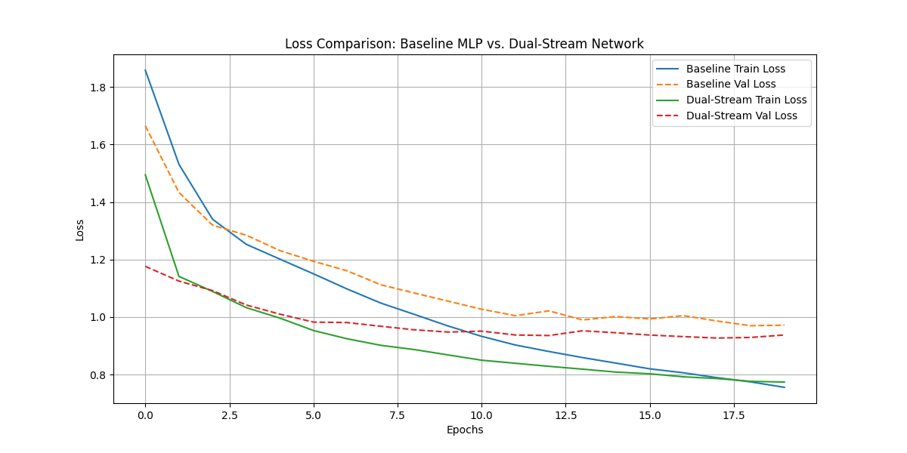

# Dual-Stream Network Experiment

This experiment investigates a novel "Dual-Stream" neural network architecture.

## Hypothesis

The core hypothesis is that a neural network can achieve better performance by processing both the raw input data and its Fourier transform in parallel. The raw data stream learns features from the time domain, while the Fourier-transformed stream learns from the frequency domain. By combining features from both streams, the model should have a more comprehensive understanding of the data, leading to improved accuracy and faster convergence compared to a standard MLP.

## Methodology

### Models

1.  **Dual-Stream Network:** This model has two parallel MLP streams.
    *   **Stream 1:** Processes the raw input data.
    *   **Stream 2:** Processes the magnitude of the Fast Fourier Transform (FFT) of the input data.
    The outputs of these two streams are concatenated and passed through a final linear layer to produce the classification.

2.  **Baseline MLP:** A standard Multi-Layer Perceptron with a similar number of trainable parameters to the Dual-Stream Network to ensure a fair comparison.

### Dataset

The `mnist1d` dataset was used for this experiment. It's a 1D version of the classic MNIST dataset, which allows for rapid prototyping and training.

### Training

Both models were trained for 20 epochs using the Adam optimizer with a learning rate of 0.001. The loss function was Cross-Entropy Loss. The parameter counts were kept similar:
*   **Baseline MLP:** ~7,434 parameters
*   **Dual-Stream Network:** ~7,370 parameters

## Results

The Dual-Stream Network consistently outperformed the baseline MLP, achieving a lower validation loss and converging more quickly.

The final validation loss after 20 epochs was:
*   **Baseline MLP:** 0.9715
*   **Dual-Stream Network:** 0.9374

## Conclusion

The results support the initial hypothesis. The Dual-Stream Network, by leveraging both time-domain and frequency-domain features, learned more effectively than the standard MLP. This suggests that for certain types of data, particularly 1D signals, this architecture could be a promising approach. Future work could explore different methods of combining the two streams or applying this architecture to other signal-based datasets.
