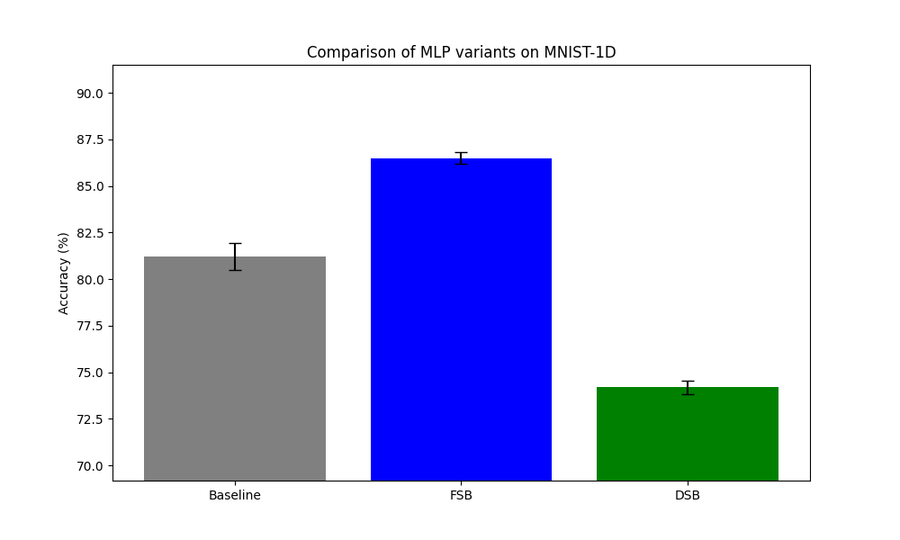
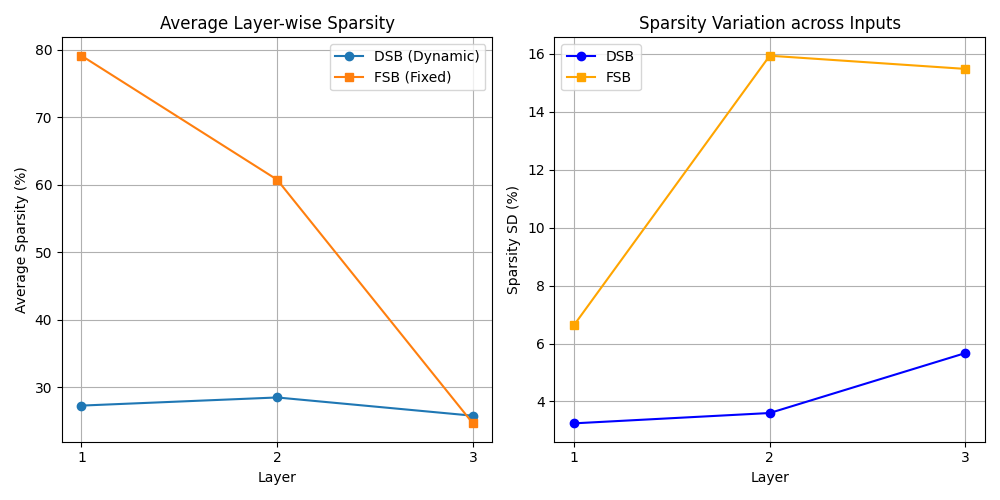

# Dynamic Sparse Bottleneck (DSB) Experiment

## Overview
The Dynamic Sparse Bottleneck (DSB) is an architectural component designed to introduce input-dependent sparsity into neural networks. Unlike standard Sparse Bottlenecks (FSB) that use a fixed (though learnable) threshold for soft-thresholding, DSB uses a small sub-network to predict a threshold for each neuron based on the current input vector.

The goal of this experiment was to evaluate if dynamic sparsity provides better adaptive capacity compared to fixed sparsity or standard GELU activations on the MNIST-1D dataset.

## Method
Each DSB layer performs the following operation on input $x$:
1. Predict threshold $\tau = \text{softplus}(W_\tau x + b_\tau)$
2. Apply soft-thresholding: $y = \text{sign}(x) \cdot \max(0, |x| - \tau)$

We compare three MLP variants:
- **Baseline MLP**: Standard MLP with GELU activations.
- **FSB MLP**: MLP where each hidden layer is followed by a Fixed Sparse Bottleneck (soft-thresholding with a learnable, but input-independent threshold vector).
- **DSB MLP**: MLP where each hidden layer is followed by a Dynamic Sparse Bottleneck.

## Results

### Accuracy Comparison
The models were tuned using Optuna (10 trials for LR) and then trained for 50 epochs over 3 different seeds.

| Model | Accuracy (%) | Best LR |
|-------|--------------|---------|
| Baseline | 81.22% ± 0.73% | 0.00457 |
| **FSB** | **86.50% ± 0.32%** | 0.00337 |
| DSB | 74.18% ± 0.38% | 0.00051 |

### Sparsity Analysis
We measured the percentage of zeroed-out activations (Sparsity) across the test set.

| Layer | DSB Mean Sparsity | DSB SD (across inputs) | FSB Mean Sparsity | FSB SD (across inputs) |
|-------|-------------------|-------------------------|-------------------|-------------------------|
| 1 | 27.32% | 3.24% | 79.15% | 6.64% |
| 2 | 28.52% | 3.60% | 60.78% | 15.94% |
| 3 | 25.82% | 5.67% | 24.69% | 15.48% |

## Observations
1. **FSB Outperforms Others**: Surprisingly, the Fixed Sparse Bottleneck (FSB) significantly outperformed both the Baseline and DSB. This suggests that for MNIST-1D, aggressive and consistent sparsity in the early layers is highly beneficial.
2. **DSB Underperformance**: The DSB model performed worse than the baseline. This could be due to several factors:
   - **Optimization Difficulty**: Predicting thresholds per input adds complexity to the loss landscape.
   - **Overfitting**: DSB has significantly more parameters (due to the threshold predictors), which might lead to overfitting on the small MNIST-1D dataset.
   - **Sparsity Level**: DSB learned a much lower level of sparsity (avg ~27%) compared to FSB (up to 79%). It seems the model preferred to stay more "dense" when given the choice.
3. **Dynamic Variation**: While DSB was intended to be "dynamic", the variation in sparsity across inputs (SD) was actually lower than that of FSB in later layers. In FSB, the variation comes solely from the input values falling below a fixed threshold, whereas in DSB, the threshold itself can move to "catch" or "release" neurons, potentially stabilizing the sparsity level.

## Conclusion
Fixed Sparse Bottlenecks are a powerful and simple regularization tool for MNIST-1D. Making the bottleneck dynamic via input-dependent thresholding did not yield improvements in this specific setup and actually hindered performance, likely due to increased model complexity and optimization challenges.

