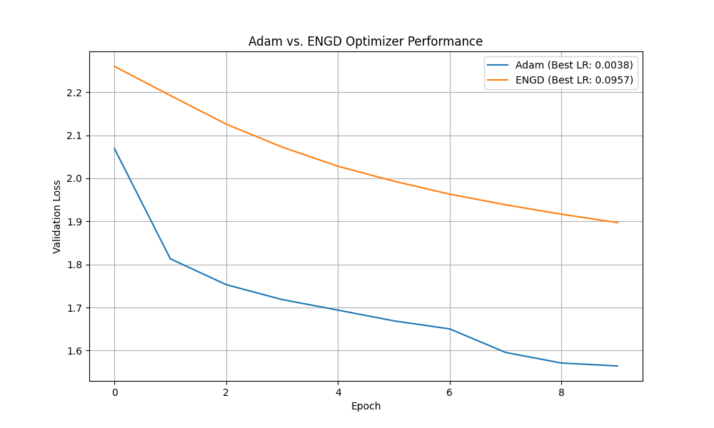

# Experiment: Eigen-Normalized Gradient Descent (ENGD)

This experiment investigates a novel optimizer called Eigen-Normalized Gradient Descent (ENGD). The core idea is to adapt the learning rate at each step by normalizing it with an estimate of the maximum eigenvalue (principal curvature) of the Hessian matrix.

## Hypothesis

Standard gradient-based optimizers like Adam can struggle in ill-conditioned loss landscapes where curvature varies significantly. By scaling the gradient step by the inverse of the Hessian's largest eigenvalue, the optimizer can take more appropriately sized steps: smaller in high-curvature areas and larger in flatter regions. This dynamic scaling is hypothesized to lead to faster convergence and better generalization compared to Adam.

## Methodology

1.  **Optimizer Implementation:** An ENGD optimizer was implemented in PyTorch. The key feature is its `step` function, which performs the following actions:
    *   Computes the gradient of the loss with respect to the model parameters, ensuring the computation graph is retained.
    *   Uses the power iteration method to efficiently estimate the largest eigenvalue of the Hessian. This is done via Hessian-vector products, calculated using `torch.autograd.grad` without materializing the full Hessian matrix.
    *   Normalizes the base learning rate by the absolute value of the estimated eigenvalue.
    *   Updates the model's parameters using the normalized gradient step.

2.  **Comparison Setup:**
    *   **Model:** A simple Multi-Layer Perceptron (MLP) with two hidden layers (128 and 64 neurons with ReLU activations) was used.
    *   **Dataset:** The `mnist1d` dataset was used for both training and validation. A subset of 1000 samples was used for the training phase of hyperparameter tuning to speed up the process.
    *   **Baseline:** The Adam optimizer was chosen as the baseline for comparison.

3.  **Fair Comparison:** To ensure a fair comparison, the base learning rate for both ENGD and Adam was tuned independently using the Optuna library. A hyperparameter search over 20 trials was conducted for each optimizer to find the learning rate that minimized the validation loss over 10 epochs. The best-performing learning rate for each was then used for the final comparison run.

## Results

The hyperparameter tuning resulted in the following optimal learning rates:
*   **Adam:** 0.0038
*   **ENGD:** 0.0957

The performance of the tuned optimizers is shown in the plot below:

As the plot illustrates, the standard Adam optimizer consistently achieved a lower validation loss than the ENGD optimizer throughout the training process. ENGD, despite its theoretically appealing dynamic step sizing, converged to a significantly higher validation loss.

## Conclusion

The hypothesis that normalizing the gradient step by the Hessian's maximum eigenvalue would lead to superior performance is not supported by the results of this experiment. On the `mnist1d` dataset, the Eigen-Normalized Gradient Descent optimizer performed worse than a well-tuned Adam optimizer.

Several factors could contribute to this outcome:
*   **Eigenvalue Estimation Noise:** The power iteration method provides an estimate, and noise or instability in this estimation from batch to batch could lead to erratic step sizes.
*   **Focus on a Single Curvature:** Normalizing by only the maximum eigenvalue ignores the rest of the curvature information and might be too simplistic an adaptation.
*   **Interaction with Base Learning Rate:** The dynamic scaling might interact with the base learning rate in a complex, non-beneficial way.

Further research could explore more robust eigenvalue estimation techniques, normalization using other spectral properties of the Hessian, or combining this approach with momentum-based methods. However, in this direct comparison, the proposed ENGD method did not prove to be an effective optimization strategy.
