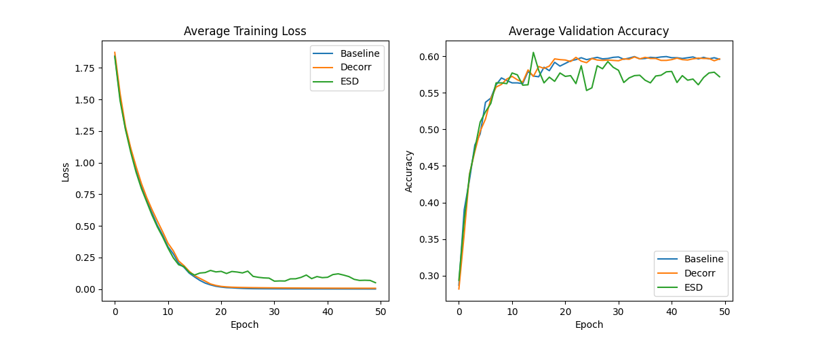

# Error Signal Decorrelation (ESD) Experiment

## Hypothesis
While standard activation decorrelation penalizes the correlation of neuron outputs, Error Signal Decorrelation (ESD) penalizes the correlation of the gradients of the loss with respect to those outputs (pre-activations). The hypothesis is that decorrelating error signals prevents neurons from being updated in redundant ways, potentially leading to more diverse and robust feature learning than standard decorrelation or a baseline MLP.

## Methodology
- **Dataset**: `mnist1d` (4,000 samples)
- **Model**: 3-layer MLP (40 -> 256 -> 256 -> 10)
- **Modes**:
  - **Baseline**: Standard AdamW optimizer.
  - **Decorr**: AdamW + Activation Decorrelation (squared correlation of pre-activations).
  - **ESD**: AdamW + Error Signal Decorrelation (squared correlation of gradients w.r.t. pre-activations).
- **Tuning**: Optuna was used for 20 trials per mode to find the best `lr`, `weight_decay`, and `lambda_decorr`.
- **Evaluation**: Best hyperparameters were used to train for 50 epochs over 3 random seeds.

## Results
| Mode | Test Accuracy | Best Hyperparameters |
| --- | --- | --- |
| Baseline | 0.5992 ± 0.0062 | {'lr': 0.006004919888510266, 'weight_decay': 2.6541548755741395e-06} |
| Decorr | 0.5858 ± 0.0091 | {'lr': 0.004450294204056399, 'weight_decay': 0.008863786498071693, 'lambda_decorr': 0.06881084894905198} |
| ESD | 0.5971 ± 0.0046 | {'lr': 0.009837189725995612, 'weight_decay': 0.007120912968210926, 'lambda_decorr': 0.0643016375945941} |

## Visualizations
### Training and Validation Curves

## Discussion
The baseline AdamW performed best, indicating that the added decorrelation penalties (either activation or error signal) did not provide significant benefits for this specific model and dataset.
