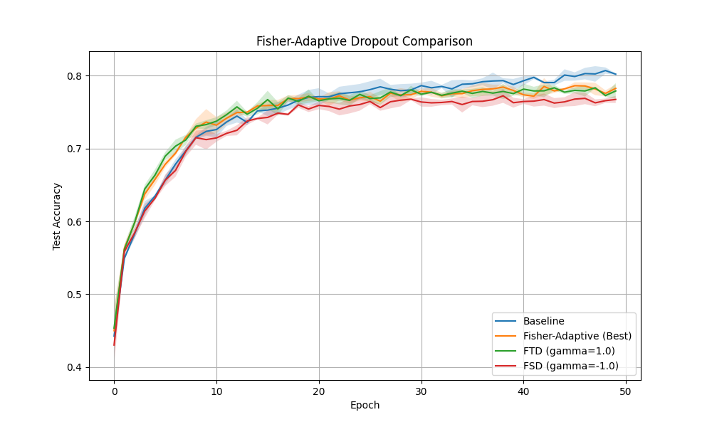

# Fisher-Adaptive Dropout (FAD) Experiment

## Hypothesis
Standard dropout treats all neurons equally. However, some neurons might be more important for the model's performance than others. We hypothesize that adaptively adjusting the dropout probability of each neuron based on its "importance" (proxied by its Fisher Information) can improve generalization.

We explore two main strategies:
1.  **Fisher-Targeted Dropout (FTD):** Drop important neurons more frequently ($\gamma > 0$). This forces the model to learn redundant representations and may prevent over-reliance on a few "super-neurons".
2.  **Fisher-Sparing Dropout (FSD):** Drop important neurons less frequently ($\gamma < -0.5$). This protects the most informative features while regularizing the noisier ones.

## Methodology
- **Dataset:** `mnist1d` (10,000 samples).
- **Model:** 3-layer MLP (40 -> 256 -> 256 -> 10).
- **Technique:** `FisherDropout` layer estimates the running average of squared activations ($x^2$) as a proxy for Fisher Information.
  - $p_j = p_{base} \cdot (\frac{F_j}{\text{mean}(F)})^\gamma$
  - $p_j$ is clipped to $[0, 0.95]$.
- **Hyperparameter Tuning:** 30 trials using Optuna to find the best `lr`, `weight_decay`, `p_base`, and `gamma` ($\gamma \in [-2, 2]$).
- **Comparison:** We compared the best found Fisher-Adaptive configuration against a Baseline (standard dropout, $\gamma=0$) and fixed $\gamma$ variants.

## Results
Final evaluation over 3 random seeds (50 epochs):

| Mode | Test Accuracy | Note |
|------|---------------|------|
| **Baseline** | **80.20% ± 0.11%** | Standard Dropout ($p=0.2$) |
| Fisher-Adaptive (Best) | 78.25% ± 0.55% | $\gamma = 0.80$, $p_{base} = 0.07$ |
| FTD (gamma=1.0) | 77.90% ± 1.08% | Targeted Dropout |
| FSD (gamma=-1.0) | 76.73% ± 0.49% | Sparing Dropout |

### Analysis
- In this specific setup on `mnist1d`, **Standard Dropout outperformed the adaptive variants**.
- Fisher-Targeted Dropout ($\gamma > 0$) performed better than Fisher-Sparing Dropout ($\gamma < 0$), suggesting that forcing the model to learn redundant features is more beneficial than protecting "important" ones for this task.
- The relatively low $p_{base}$ (0.07) selected by Optuna for the adaptive model might indicate that the adaptive scaling already provides significant regularization.



## Conclusion
While Fisher-Adaptive Dropout provides a principled way to differentiate neuron importance during training, it did not provide a performance gain over a well-tuned standard dropout on the `mnist1d` dataset. This might be because the "importance" proxy (squared activations) is too simple, or because the dataset is small enough that uniform regularization is already very effective.

Future work could investigate using actual gradients of the loss w.r.t. pre-activations for a more accurate Fisher Information estimate, or applying FAD to larger models and datasets where feature redundancy is more critical.

## How to Run
To reproduce the tuning:
```bash
export PYTHONPATH=$PYTHONPATH:$(pwd)/fisher_adaptive_dropout_experiment
python3 fisher_adaptive_dropout_experiment/train.py
```
To reproduce the comparison:
```bash
export PYTHONPATH=$PYTHONPATH:$(pwd)/fisher_adaptive_dropout_experiment
python3 fisher_adaptive_dropout_experiment/compare.py
```
