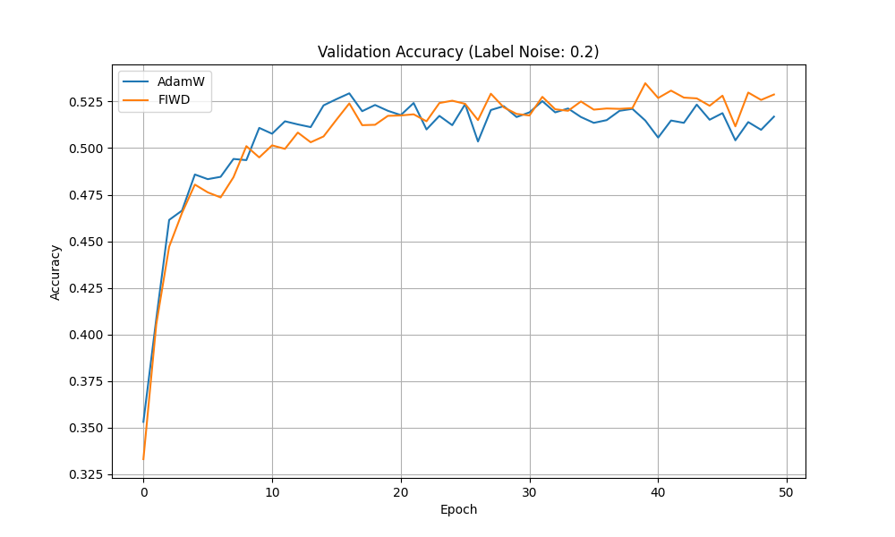

# Fisher-Inverse Weight Decay (FIWD) Experiment

This experiment investigates **Fisher-Inverse Weight Decay (FIWD)**, a technique that scales the weight decay of each parameter based on its empirical Fisher Information.

## Hypothesis

Standard weight decay (L2 regularization) penalizes all weight components equally. However, from an information-theoretic perspective, some parameters are more important for the model's output distribution than others.

We hypothesize that applying **stronger weight decay to parameters with low Fisher Information** (which have less influence on the output) and **weaker weight decay to parameters with high Fisher Information** will improve generalization, especially in the presence of noise. This selectively prunes "unimportant" parameters while protecting the "core" features learned by the model.

## Methodology

### FIWD Optimizer
The weight decay update is modified as follows:
$$w_i \gets w_i (1 - \eta \lambda \phi(F_{ii}))$$
where $\phi(F_{ii}) = (1 + F_{ii}/\tau)^{-\gamma}$ and $F_{ii}$ is the bias-corrected moving average of squared gradients (empirical Fisher).

### Experimental Setup
- **Dataset:** `mnist1d` with **20% label noise** to test robustness.
- **Model:** 3-layer MLP (40 -> 256 -> 256 -> 10) with ReLU.
- **Baseline:** Tuned AdamW.
- **Comparison:** AdamW vs. FIWD-AdamW.
- **Hyperparameter Tuning:** Optuna (30 trials each) to tune learning rate, weight decay, and FIWD parameters ($\gamma, \tau$).
- **Final Evaluation:** Best models trained for 50 epochs over 3 random seeds.

## Results

| Method | Mean Test Accuracy | Best Hyperparameters |
| :--- | :--- | :--- |
| **AdamW** | 63.42% ± 0.57% | `lr`: 4.94e-3, `wd`: 0.455 |
| **FIWD** | 63.00% ± 0.67% | `lr`: 3.11e-3, `wd`: 0.808, $\gamma$: 0.66, $\tau$: 5.57e-4 |

### Analysis
- In this specific setup on `mnist1d` with 20% label noise, FIWD performed **slightly worse** than the tuned AdamW baseline (63.00% vs 63.42%).
- The optimal weight decay for FIWD was higher than the baseline (0.808 vs 0.455), confirming that the scaling factor $\phi(F_{ii})$ effectively reduced the overall regularization pressure, requiring a higher base coefficient.
- Although the hypothesis was not strongly supported by a performance boost, FIWD demonstrated comparable results, suggesting it is a viable form of structural regularization.

## Visualizations

## Conclusion
Fisher-Inverse Weight Decay provides a theoretically motivated way to apply selective regularization. While it did not outperform a well-tuned AdamW on `mnist1d` with label noise, it offers a new axis for controlling model capacity based on parameter importance. Future work could explore more accurate curvature estimates or different scaling functions.
