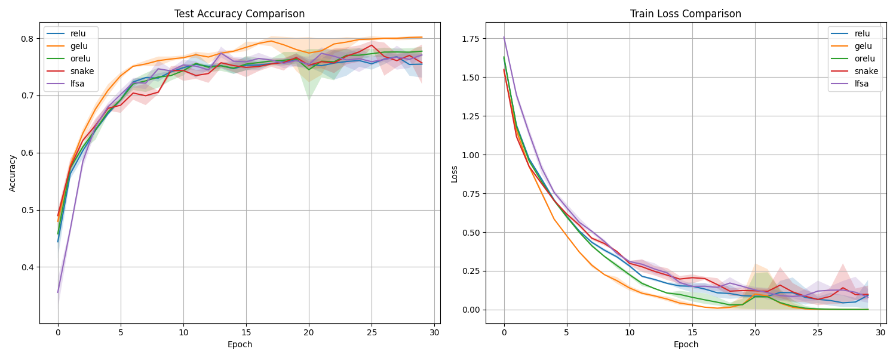
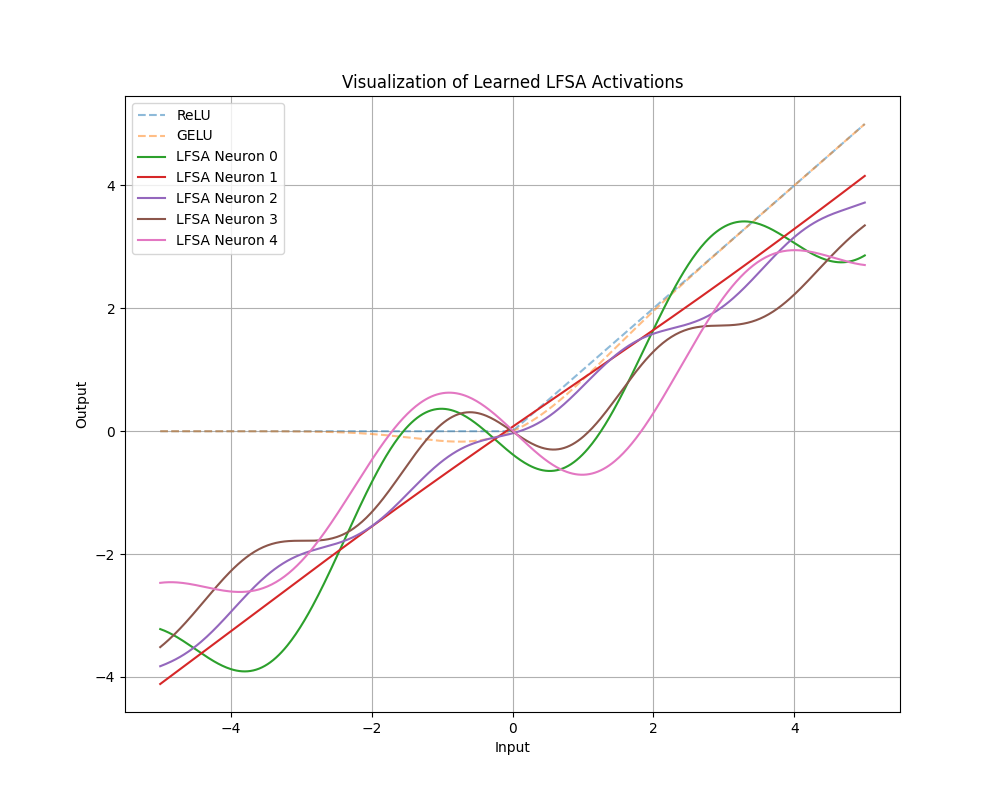

# Learnable Fourier Series Activation (LFSA) Experiment

This experiment investigates the use of finite Fourier series as learnable activation functions in neural networks.

## Hypothesis
Traditional activation functions like ReLU or GELU have fixed shapes. While periodic activations like Sine (SIREN) or ORelu have been proposed, they often use a single frequency. We hypothesized that a more flexible activation function based on a learnable Fourier series could adapt its shape to the data more effectively, potentially improving convergence or final accuracy.

## Method
The **Learnable Fourier Series Activation (LFSA)** is defined as:
$$f(x) = w x + b + \sum_{k=1}^K a_k \sin(\omega_k x + \phi_k)$$
where:
- $w, b$ define a global linear trend.
- $a_k, \omega_k, \phi_k$ are learnable parameters for each of the $K$ Fourier components.
- In our implementation, we used $K=4$ and made parameters learnable per-neuron.

## Experimental Setup
- **Dataset**: MNIST1D
- **Model**: MLP with 2 hidden layers of 256 units.
- **Baselines**: ReLU, GELU, ORelu (ReLU + Sine), Snake ($x + \sin^2 x$).
- **Optimization**: Adam optimizer with learning rate tuned via Optuna for each activation type (10 trials each).
- **Evaluation**: 3 trials with different random seeds for each activation.

## Results

Final Test Accuracy on MNIST1D:

| Activation | Mean Accuracy | Std Dev | Best LR |
|------------|---------------|---------|---------|
| ReLU       | 75.47%        | 1.81%   | 0.0056  |
| GELU       | 80.18%        | 0.27%   | 0.0056  |
| ORelu      | 77.73%        | 0.68%   | 0.0044  |
| Snake      | 75.70%        | 2.84%   | 0.0035  |
| **LFSA**   | **77.08%**    | **0.05%** | 0.0075  |

### Observations
1. **Stability**: LFSA exhibited remarkably low variance across seeds (Std = 0.05%), suggesting that its high flexibility allows it to consistently find good solutions regardless of initialization.
2. **Performance**: LFSA outperformed standard ReLU and Snake, and performed comparably to ORelu. However, GELU remains a very strong baseline on this specific dataset.
3. **Learned Shapes**: Visualization of the learned activations shows that LFSA often learns a "wiggly" linear function, sometimes creating small localized features (bumps or dips) that might help in capturing complex patterns in the signal-based MNIST1D data.

## Visualizations

### Comparison of Accuracy and Loss

### Learned LFSA Activations

## Conclusion
Learnable Fourier Series Activations provide a highly flexible alternative to traditional activations. While they did not beat GELU on MNIST1D, they showed superior stability and improved performance over ReLU. Future work could explore using LFSA in deeper architectures or on tasks where the optimal activation shape is less understood.
