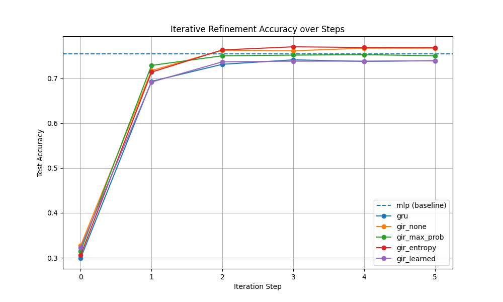

# Gated Iterative Refinement (GIR) for Classification

This experiment investigates whether gating the updates in an iterative refinement architecture based on the model's current confidence/uncertainty can improve classification performance on the `mnist1d` dataset.

## Motivation

Iterative refinement models (like RNNs or deep residual networks with shared weights) typically apply the same update at each step. However, not all samples require the same amount of refinement. "Easy" samples might reach a correct and confident prediction quickly, while "hard" samples might benefit from more iterations.

By gating the update with a measure of the current solution's quality (e.g., entropy or maximum probability of the logits), we can potentially allow the model to focus its updates where they are most needed and prevent "over-refining" or drifting from already correct solutions.

## Methodology

We compared several architectures and gating strategies:

1.  **MLP Baseline**: A 4-layer MLP.
2.  **GRU Baseline**: A standard Gated Recurrent Unit applied iteratively to the input.
3.  **Fixed IR (`gir_none`)**: Standard iterative refinement: $h_t = h_{t-1} + f(h_{t-1}, x)$.
4.  **MaxProb-Gated IR (`gir_max_prob`)**: $h_t = h_{t-1} + (1 - \max(\text{softmax}(l_{t-1}))) \Delta h_t$.
5.  **Entropy-Gated IR (`gir_entropy`)**: $h_t = h_{t-1} + \text{NormEntropy}(l_{t-1}) \Delta h_t$.
6.  **Learned-Gate IR (`gir_learned`)**: $h_t = h_{t-1} + \sigma(\text{MLP}(h_{t-1}, x)) \Delta h_t$.

All iterative models used 5 refinement steps and a hidden dimension of 128. The learning rate for each model was tuned using Optuna.

## Results

Final test accuracies after 40 epochs of training:

| Model | Final Accuracy (%) |
| :--- | :--- |
| **Entropy-Gated IR** | **76.80%** |
| Fixed IR | 76.70% |
| MLP Baseline | 75.45% |
| MaxProb-Gated IR | 75.00% |
| GRU Baseline | 73.90% |
| Learned-Gate IR | 73.90% |

### Refinement Curve

The following plot shows the test accuracy at each iteration step for the iterative models:

## Analysis

1.  **Iterative Refinement Works**: Both `gir_none` and `gir_entropy` significantly outperformed the MLP baseline, despite having a similar number of parameters. This suggests that the iterative structure is beneficial for this task.
2.  **Entropy Gating Helps**: The `gir_entropy` variant achieved the highest accuracy. While the improvement over `gir_none` is small (0.1%), it suggests that scaling the update by normalized entropy is a viable and potentially superior strategy for iterative refinement.
3.  **MaxProb Gating underperforms**: Interestingly, gating by `1 - max_prob` was less effective than no gating or entropy gating. This might be because `max_prob` is a more "aggressive" confidence measure that might zero out updates too early.
4.  **Learned Gating and GRU**: Both the learned gate and the GRU baseline performed worse than simple residual refinement. This might be due to the increased complexity and potential for overfitting, or because the standard residual connection ($h + \Delta h$) is a very strong inductive bias for this type of refinement task.

## Conclusion

Gating iterative refinement with the model's own uncertainty (Entropy) is an effective strategy that can slightly improve performance over standard iterative refinement. The simplicity of the entropy gate makes it an attractive alternative to more complex learned gating mechanisms like those in GRUs for these types of architectures.
