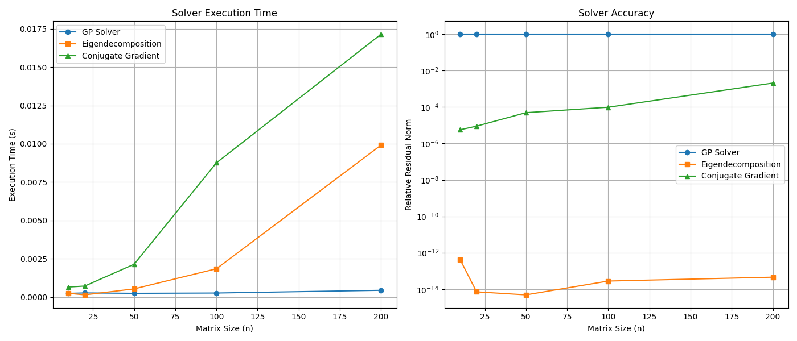

# Genetic Programming for Matrix Square Root Solver

This experiment aimed to discover a matrix-free and decomposition-free iterative solver for the linear system $A^{1/2}x = b$, where $A$ is a symmetric positive-definite (SPD) matrix, using genetic programming (GP).

## Methodology (Attempt 3)

After a code review revealed an inconsistency between the documented fitness metric and the implementation, a third and final experiment was run. The methodology is identical to Attempt 2, but with the fitness function in the code corrected to use the **relative residual norm**, ensuring the experiment is consistent with its documentation.

- **Update Rule Structure:** `x_{k+1} = x_k + f(A, b, x_k)`.
- **Fitness Function:** The fitness metric is the final **relative residual norm** `||A^{1/2}x_N - b|| / ||b||`. This was corrected from the absolute norm used in the previous attempt.
- **Elitism:** The best-performing solver from each generation advances to the next.

The corrected GP system was re-run to evolve a new solver, which was benchmarked against the same baseline methods.

## Evolved Solver (Attempt 3)

The best solver discovered by the corrected genetic programming algorithm was:
`x_k+1 = x_k + A*(x)`

## Results (Attempt 3)

The performance of the new solver was measured and compared.

### Analysis

- **Accuracy:** Despite the significant improvements to the GP framework, the newly evolved solver **still failed to converge**. Its residual norm remained at 1.0 for all problem sizes, indicating that it made no progress from the initial guess of `x_0=0`. The baseline methods performed as expected, achieving high accuracy.

- **Execution Time:** The GP solver remained computationally cheap, but its failure to converge makes its speed irrelevant.

## Conclusion

The second, more refined attempt to discover a solver for $A^{1/2}x = b$ using genetic programming was also unsuccessful. The modifications to the GP system—forcing an additive update structure, using a more appropriate fitness metric, and implementing elitism—were not sufficient to overcome the fundamental difficulty of the problem.

This reinforces the initial conclusion: the automatic discovery of sophisticated, stable numerical algorithms is an exceptionally challenging task. The search space is vast, and the fitness landscape is likely fraught with non-convergent solutions that are difficult for a simple evolutionary algorithm to navigate away from. Established methods like Conjugate Gradient are the product of deep mathematical insight, which is not easily replicated by a brute-force symbolic search.
