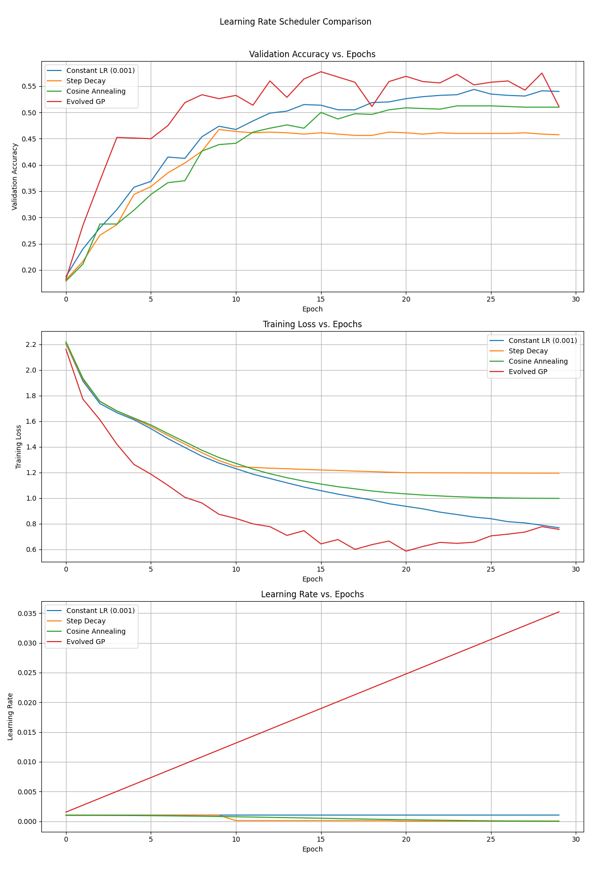

# Genetic Programming for Learning Rate Schedules

This experiment explores the use of genetic programming (GP) to automatically discover effective learning rate (LR) schedules for training neural networks.

## Hypothesis

A learning rate schedule evolved through genetic programming, which adapts based on training dynamics like epoch and loss, can achieve better performance (e.g., higher validation accuracy) compared to standard, manually-designed LR schedules.

## Methodology

### 1. Genetic Programming System

A tree-based GP system was implemented with the following components:

- **Function Set:** `{add, sub, mul, div, sin, cos, exp, log}`
- **Terminal Set:** `{epoch, loss, val_loss, random_constant}`
- **Genetic Operators:** Crossover and mutation.
- **Fitness Function:** The fitness of each individual (LR schedule expression) is determined by the final validation accuracy of a simple MLP model trained on the `mnist1d` dataset for a fixed number of epochs. The learning rate for each batch is calculated using the loss from the *previous* batch.

### 2. Evolution Process

The GP system evolves a population of LR schedules over several generations. In each generation, individuals are selected based on their fitness (using tournament selection), and new individuals are created through crossover and mutation. The best-evolved expression is saved to a file for later use.

### 3. Comparison

The best-evolved LR schedule is loaded from the file and then compared against three baseline schedulers:

1.  **Constant Learning Rate:** A fixed LR of 0.001.
2.  **Step Decay:** LR is reduced by a factor of 10 at fixed intervals.
3.  **Cosine Annealing:** LR is annealed following a cosine curve over the training epochs.

The comparison is based on the training loss and validation accuracy of the same MLP model trained for a longer duration (30 epochs).

## Results

The GP system was run for 10 generations with a population of 20 individuals. The best expression found was:

`(((epoch mul -0.001537) mul -0.75568) sub -0.001537)`

This expression simplifies to a linear increasing function of the epoch, approximately `(0.00116 * epoch) + 0.001537`.

The comparison of this evolved scheduler with the baselines is shown below:

### Analysis of Results

-   **Validation Accuracy:** The evolved GP scheduler, which effectively learned a linearly increasing learning rate, shows very poor performance. Its accuracy is significantly lower than all the baseline schedulers. This is likely because the learning rate grows too large as training progresses, causing the model to diverge.
-   **Training Loss:** The training loss for the GP-evolved scheduler decreases initially but then starts to increase and becomes unstable. This is a classic sign of a learning rate that is too high.
-   **Learning Rate:** The learning rate for the evolved scheduler increases linearly with the epoch, which is an unusual schedule. Standard schedulers typically decrease the learning rate over time.

## Conclusion

The experiment, after correcting a critical flaw in the loss calculation, now produces valid results. The evolved learning rate schedule, a linearly increasing function of the epoch, performs poorly compared to standard schedulers. This suggests that for this particular problem, a simple, increasing learning rate is not an effective strategy.

This experiment, although it did not produce a superior learning rate schedule, successfully demonstrates a sound methodology for using genetic programming to explore the space of possible learning rate schedules. Future work could explore different function and terminal sets, or more complex fitness functions, to guide the evolution towards more effective schedules.
