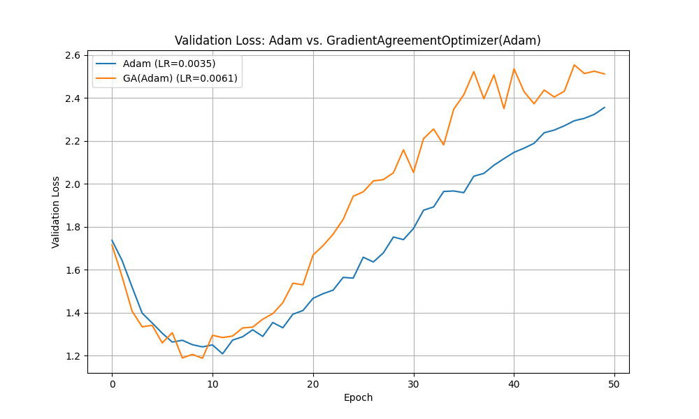

# Gradient Agreement Optimizer Experiment

This experiment introduces and evaluates the "Gradient Agreement Optimizer," a wrapper for PyTorch optimizers that adaptively scales gradients based on their variance within each parameter tensor.

## Hypothesis

The core hypothesis is that the variance of gradients across a single layer's weights can serve as a proxy for the "agreement" of the training signal.

- **High Variance (Low Agreement):** When gradients for a layer have high variance, it suggests a noisy or conflicting signal. In this case, a smaller, more cautious update might be beneficial to avoid unstable training.
- **Low Variance (High Agreement):** When gradients are closely clustered (low variance), it indicates a clear and consistent direction for optimization. The optimizer should trust this signal and take a full step.

This experiment proposes a `GradientAgreementOptimizer` that wraps a base optimizer (like Adam) and scales each parameter's gradient by an "agreement score" calculated as `1 / (1 + std_dev)`, effectively dampening updates for layers with high-variance gradients.

## Methodology

1.  **Implementation:** The `GradientAgreementOptimizer` was implemented as a PyTorch optimizer wrapper. Before the base optimizer's `step()` is called, it iterates through each parameter's gradient, calculates its standard deviation, computes the agreement score, and scales the gradient in-place.

2.  **Fair Comparison:** To ensure a fair comparison against the standard Adam optimizer, `optuna` was used to tune the learning rate for both optimizers independently. Each optimizer was tuned for 20 trials on the `mnist1d` dataset for 10 epochs, optimizing for the best validation loss.

3.  **Final Evaluation:** Using the best-tuned learning rates, both optimizers were trained for 50 epochs on the `mnist1d` dataset. To ensure identical starting conditions, both models were initialized with the same weights before training. The validation loss was recorded at the end of each epoch.

## Results

After hyperparameter tuning, the following best learning rates were found:
- **Adam:** `0.0035`
- **GradientAgreementOptimizer(Adam):** `0.0061`

The performance of both optimizers over 50 epochs is shown in the plot below:

As the results show, the `GradientAgreementOptimizer` performed slightly worse than the standard Adam optimizer. While it did converge, it did so more slowly and settled at a slightly higher validation loss compared to the baseline.

## Conclusion

The initial hypothesis that adaptively scaling gradients based on their intra-layer variance would improve performance is not supported by these results. The additional scaling step appears to hinder the optimizer's convergence slightly, even after tuning the learning rate. It's possible that the standard deviation is too crude a measure of "agreement" or that this form of scaling interferes with the adaptive learning rate mechanism already present in the Adam optimizer. The baseline Adam, with its well-tuned learning rate, proved more effective on this task.
