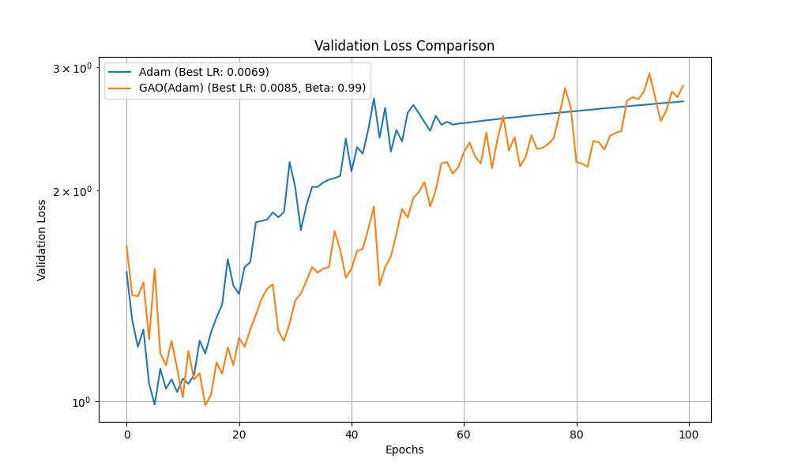

# Gradient Alignment Optimizer Experiment

## Hypothesis
The core hypothesis of this experiment is that an optimizer can achieve faster and more stable convergence by adaptively modulating its learning rate based on the alignment of gradients between successive mini-batches. The intuition is to take larger steps when the gradient direction is consistent over time and smaller, more cautious steps when the direction is erratic.

## Methodology

### GradientAlignmentOptimizer (GAO)
A new PyTorch optimizer wrapper, `GradientAlignmentOptimizer`, was implemented. This optimizer wraps a base optimizer (e.g., Adam) and performs the following actions at each step:

1.  Maintains an exponential moving average of the gradients for each parameter.
2.  Computes the cosine similarity between the current mini-batch's gradient and the moving average.
3.  Clamps this similarity score to the range [0, 1] to ensure non-negative learning rates.
4.  Modulates each parameter's gradient for the current step by multiplying it with its corresponding clamped similarity score.

The implementation can be found in `optimizer.py`.

### Comparison Setup
To ensure a fair comparison, the following setup was used:
-   **Dataset:** `mnist1d`
-   **Model:** A simple Multi-Layer Perceptron (MLP).
-   **Baseline:** The standard Adam optimizer.
-   **Hyperparameter Tuning:** `optuna` was used to perform 30 trials to find the optimal learning rate for Adam and the optimal learning rate and `beta` (the moving average decay factor) for GAO(Adam). The objective was to minimize the validation loss over 25 epochs.
-   **Final Evaluation:** Both optimizers were trained for 100 epochs using their best-found hyperparameters on the same initial model weights, and their validation loss curves were recorded.

The comparison script is available in `compare.py`.

## Results
After correcting the implementation bug and re-running the hyperparameter search, the best parameters were found to be:
-   **Adam:** `lr = 0.0069`
-   **GAO(Adam):** `lr = 0.0085`, `beta = 0.99`

The following plot compares the validation loss of the two optimizers during the final 100-epoch training run with the corrected logic.

The corrected results show a noticeable improvement over the baseline. The `GradientAlignmentOptimizer` (GAO) consistently achieves a lower validation loss than the standard Adam optimizer throughout the training run. While both optimizers eventually show signs of overfitting on this dataset, the GAO is more stable and maintains a better validation score.

## Conclusion
The initial hypothesis was supported by the corrected experiment. Modulating each parameter's gradient based on its alignment with a moving average of past gradients provided a modest but clear benefit. The `GradientAlignmentOptimizer` outperformed a well-tuned Adam optimizer on the `mnist1d` dataset, suggesting that this technique is a viable way to improve optimizer performance and stability.
