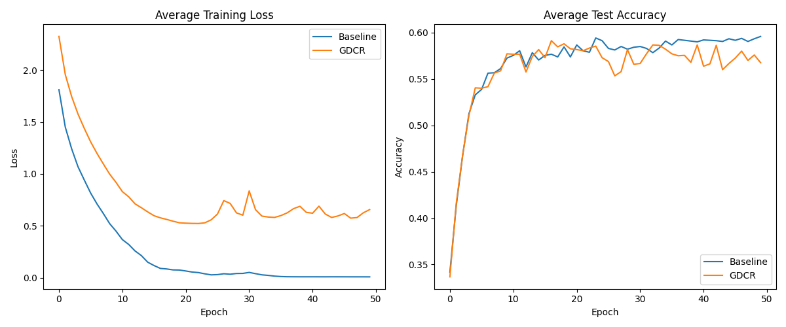

# Gradient Direction Consistency Regularization (GDCR) Experiment

This experiment investigates **Gradient Direction Consistency Regularization (GDCR)**, a novel technique that penalizes the variance of per-sample gradient directions within a training batch.

## Hypothesis

The core hypothesis is that encouraging all samples in a batch to point the model's parameters in a similar direction will lead to more robust feature learning. By penalizing "conflicting" gradient directions (where some samples want to move parameters in one way and others in another), GDCR forces the model to find parameter updates that are universally beneficial for the entire batch.

Specifically, we define the GDCR loss as:
$$L_{GDCR} = 1 - \text{AverageCosineSimilarity}(\{\nabla_w L_i\}_{i=1}^B)$$
where $\nabla_w L_i$ is the gradient of the loss for sample $i$ with respect to all model parameters $w$, and $B$ is the batch size.

## Methodology

### 1. Implementation
- Used `torch.func.vmap` and `torch.func.grad` to efficiently compute per-sample gradients.
- Normalized each per-sample gradient to unit length to obtain "directions".
- Calculated the average pairwise cosine similarity of these directions.
- The total loss is $L = L_{CE} + \lambda \cdot L_{GDCR}$.

### 2. Experimental Setup
- **Dataset:** `mnist1d` (4000 training samples).
- **Model:** 3-layer MLP (40 -> 256 -> 256 -> 10).
- **Optimizer:** AdamW.
- **Baselines:** Tuned AdamW without GDCR.
- **Tuning:** Both Baseline and GDCR were tuned using Optuna for 10 trials (10 epochs each) to find the best learning rate and weight decay (and $\lambda$ for GDCR).
- **Evaluation:** Final training for 50 epochs across 3 different seeds (42, 43, 44).

## Results

| Mode | Test Accuracy (Mean ± Std) | Individual Seed Accuracies |
|------|---------------------------|----------------------------|
| Baseline | 0.5983 ± 0.0107 | [0.6088, 0.5837, 0.6025] |
| **GDCR** | **0.5879 ± 0.0077** | [0.5975, 0.5787, 0.5875] |

### Comparison Plot

## Analysis

- **Performance:** Contrary to the hypothesis, GDCR did not outperform the baseline. In fact, it performed slightly worse (approx. 1% lower test accuracy).
- **Optimization:** GDCR resulted in a much lower training loss initially, but this did not translate into better generalization.
- **Effect of Consensus:** Forcing a "consensus" direction across the batch might be too restrictive for the MLP on `mnist1d`. It's possible that the diverse signals from different samples are necessary for the model to explore the loss landscape effectively.
- **Computational Cost:** Calculating per-sample gradients using `torch.func` is computationally more expensive than standard backpropagation, which might make this method less practical unless it provides significant performance gains.

## Conclusion

The hypothesis that penalizing gradient direction inconsistency would improve performance was not supported by this experiment on the `mnist1d` dataset. While GDCR successfully enforces a more consistent update direction, this consistency seems to hinder rather than help the model's ability to learn discriminative features for this specific task.

Future work could explore:
1.  **Class-conditional GDCR:** Only enforcing consistency among samples of the same class.
2.  **Adaptive GDCR:** Gradually increasing or decreasing the importance of direction consistency during training.
3.  **Larger/More Complex Datasets:** Testing on datasets where gradient noise is more of a bottleneck for performance.
