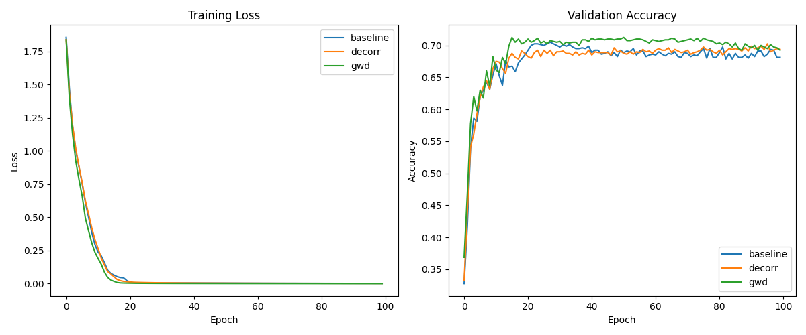

# Gradient-Weighted Decorrelation (GWD) Experiment

This experiment introduces **Gradient-Weighted Decorrelation (GWD)**, a novel regularization technique that adaptively penalizes the correlation between neuron activations based on the alignment of their gradients.

## Hypothesis

Standard decorrelation (like DeCov) penalizes the correlation between all pairs of neurons in a layer to reduce redundancy. However, some correlation might be necessary for learning complex features.

Our hypothesis is that redundancy is most harmful when neurons are not only correlated in their activations but also being **updated in the same direction** by the optimizer. By weighting the decorrelation penalty by the cosine similarity of the neurons' gradients, we can target neurons that are becoming redundant while allowing for necessary co-activations.

Specifically, the penalty for a layer is defined as:
$$L_{GWD} = \alpha \sum_{j < k} \text{corr}(a_j, a_k)^2 \cdot \max(0, \text{cos\_sim}(g_j, g_k))^\gamma$$
where $a_i$ is the activation of neuron $i$ and $g_i$ is its gradient (or a moving average of its gradient, like Adam's first moment).

## Methodology

### Dataset
- `mnist1d`: A 1D version of the MNIST dataset.
- 4000 training samples (split 80/20 for train/validation).

### Model
- 3-layer MLP with 512 hidden units in each hidden layer.
- ReLU activations.

### Comparison
1. **Baseline**: Tuned AdamW.
2. **Decorr**: Tuned AdamW + Standard activation decorrelation ($\alpha \sum \text{corr}^2$).
3. **GWD**: Tuned AdamW + Gradient-Weighted Decorrelation.

### Hyperparameter Tuning
- Each method was tuned using **Optuna** for 30 trials.
- Search space:
    - `lr`: $[1e-4, 1e-2]$ (log)
    - `weight_decay`: $[1e-6, 1e-1]$ (log)
    - `alpha` (for Decorr and GWD): $[1e-3, 10.0]$ (log, applied to the mean penalty)
    - `gamma` (for GWD only): $[0.1, 3.0]$

### Stability Improvements
- Used Adam's `exp_avg` (first moment) instead of raw gradients for $g_i$ to ensure a stable directional signal.
- Normalized the penalty by the number of pairs (mean instead of sum) to make $\alpha$ more scale-invariant.
- Used the best validation model for final testing.

## Results

| Method | Best Validation Acc | Test Accuracy |
|--------|---------------------|---------------|
| Baseline | 70.50% | 67.60% |
| Decorr | 70.25% | 66.60% |
| **GWD** | **71.25%** | **68.60%** |

### Analysis
- **GWD outperformed the baseline** by **1.0%** absolute test accuracy.
- **Standard Decorr performed worse** than the baseline, suggesting that indiscriminate decorrelation can be too restrictive.
- The optimal $\gamma \approx 0.62$ suggests that even moderate gradient alignment is enough to trigger the decorrelation penalty.
- The higher best validation accuracy of GWD (71.25% vs 70.50%) indicates that it helps the model find better solutions.

### Training Curves

## Conclusion

The hypothesis was **supported**. Weighting the decorrelation penalty by gradient similarity allows for a more effective and targeted form of regularization compared to standard decorrelation. By focusing on neurons that are both correlated and moving in the same direction, GWD successfully reduces harmful redundancy and improves generalization on the `mnist1d` dataset.

## Future Work
- Evaluate on larger datasets like CIFAR-10 or ImageNet.
- Investigate the effect of GWD on different architectures (CNNs, Transformers).
- Compare with other diversity-promoting techniques like INGO or SGO.
