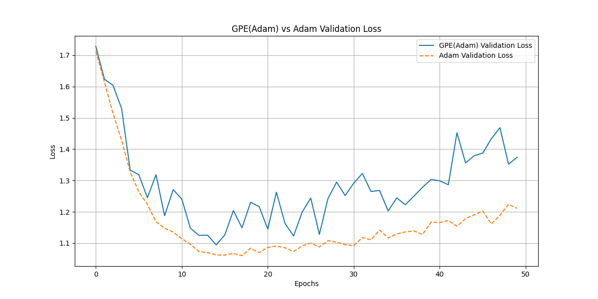

# Gradient Polynomial Extrapolation (GPE) Optimizer

This experiment investigates a novel optimizer called Gradient Polynomial Extrapolation (GPE).

## Hypothesis

Standard momentum-based optimizers, like Adam, use an exponential moving average of past gradients to determine the update direction. The hypothesis of this experiment is that we can achieve a more accurate prediction of the future gradient trajectory by fitting a low-degree polynomial to the recent history of gradients for each parameter and extrapolating one step into the future. This "lookahead" gradient could potentially lead to faster and more stable convergence if the gradient's path is locally smooth and predictable.

## Methodology

1.  **GPE Optimizer:** An optimizer wrapper, `GPE`, was implemented. It wraps a base optimizer (in this case, `torch.optim.Adam`). For each parameter, it stores a history of the last `k` gradients. At each step, it fits a polynomial of degree `d` to this history and uses the polynomial to extrapolate the gradient for the next time step. This extrapolated gradient is then passed to the base optimizer.

2.  **Dataset and Model:** The experiment was conducted on the `mnist1d` dataset, a standard benchmark within this repository. A simple Multi-Layer Perceptron (MLP) was used as the model.

3.  **Fair Comparison:** To ensure a fair comparison between GPE(Adam) and the standard Adam optimizer, we used the `optuna` library to perform hyperparameter tuning for both.
    *   For **Adam**, we tuned the learning rate.
    *   For **GPE(Adam)**, we tuned the learning rate, the gradient history size (`history_size`), and the polynomial degree (`degree`).

    Both studies were run for 30 trials. The best-performing set of hyperparameters for each optimizer was then used for a final 50-epoch training run to generate the comparison results. The models were initialized with the same random weights for the final comparison.

## Results

After the hyperparameter tuning, the best configurations were found to be:

*   **Best GPE(Adam) params:** `{'lr': 0.00647, 'history_size': 9, 'degree': 1}`
*   **Best Adam params:** `{'lr': 0.00402}`

Interestingly, the best-performing GPE model used a polynomial degree of 1, which corresponds to simple linear extrapolation.

The final comparison using these optimal parameters is shown below:

As the plot shows, the standard Adam optimizer consistently achieved a lower validation loss than the GPE(Adam) optimizer throughout the training process. The GPE optimizer, while following a similar convergence path, was less effective and exhibited slightly more instability in its validation loss.

## Conclusion

The hypothesis was **not supported** by the results of this experiment. Extrapolating the gradient trajectory using a polynomial fit did not provide a performance benefit over the standard momentum-based approach used by Adam. In fact, it performed slightly worse on the `mnist1d` dataset. This suggests that either the gradient trajectories are too noisy for simple polynomial extrapolation to be effective, or the computational overhead and potential for extrapolation error outweigh any benefits.
