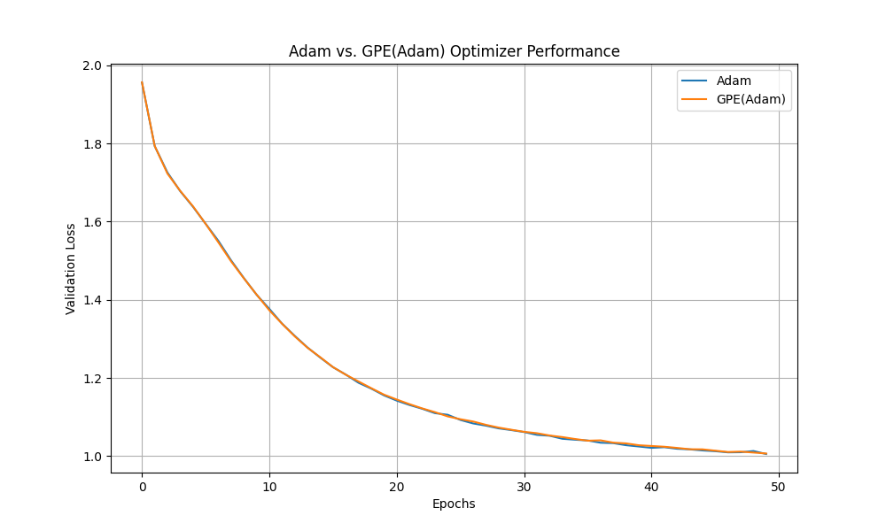

# Gradient Polynomial Extrapolation (GPE) Optimizer Experiment

This experiment investigates a novel optimizer called Gradient Polynomial Extrapolation (GPE), which aims to accelerate convergence by fitting a polynomial to the recent trajectory of each parameter's gradient and extrapolating a future gradient.

## Hypothesis

The core hypothesis is that the trajectory of gradients is more stable and predictable than the trajectory of the parameters themselves. By extrapolating the gradient, we can "denoise" the updates and provide a better-informed update direction to a base optimizer (like Adam), leading to faster and more stable convergence.

## Methodology

1.  **Optimizer Implementation**: A PyTorch optimizer named `GPE` was implemented in `optimizer.py`. This optimizer wraps a base optimizer (in this case, `torch.optim.Adam`) and maintains a history of gradients. In each step, it fits a 2nd-degree polynomial to the last 10 gradients for each parameter, extrapolates the next gradient, and then uses a weighted average of the current and extrapolated gradients (`alpha=0.4`) to update the model.

2.  **Comparison Setup**: The `compare.py` script was created to benchmark the performance of `GPE(Adam)` against the standard `Adam` optimizer.
    *   **Dataset**: The `mnist1d` dataset was used, with 10,000 training samples.
    *   **Model**: A simple Multi-Layer Perceptron (MLP) with one hidden layer of 128 neurons and a ReLU activation function.
    *   **Fairness**: To ensure a fair comparison, both optimizers started with the exact same initial model weights and used the same learning rate of `1e-3`.

3.  **Execution**: The script trained the model for 50 epochs with both optimizers and recorded the validation loss at the end of each epoch.

## Results

The training logs show the validation loss for both optimizers over 50 epochs. The final validation loss for Adam was ~1.005, while for GPE(Adam) it was ~1.006. The performance of both optimizers is visualized in the plot below:

As seen in the plot, the `GPE(Adam)` optimizer's performance is almost identical to the standard `Adam` optimizer. There is no significant difference in convergence speed or stability.

## Conclusion

The hypothesis that extrapolating gradients would lead to faster or more stable convergence is not supported by the results of this experiment. The `GPE` optimizer performed on par with Adam, suggesting that, for this task, simple polynomial extrapolation of the gradient does not offer any advantage. The added computational overhead of the GPE optimizer makes it a less efficient choice than the standard Adam optimizer.
