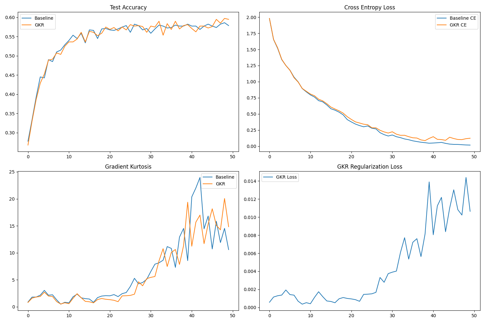

# Gradient Kurtosis Regularization (GKR)

This experiment investigates Gradient Kurtosis Regularization (GKR), a technique that penalizes the excess kurtosis of per-sample gradient norms within a batch.

## Hypothesis

The hypothesis is that high kurtosis in the distribution of per-sample gradient norms indicates the presence of "outlier" samples that dominate the update signal. By penalizing this kurtosis, we encourage the model to learn from the entire batch more evenly, potentially leading to better generalization and more stable training.

## Method

GKR adds a regularization term to the loss function:

$$L_{total} = L_{CE} + \lambda \cdot \text{Kurtosis}(\{\| \nabla_w L_i \|_2\}_{i=1}^B)$$

where:
- $L_i$ is the loss for the $i$-th sample in a batch of size $B$.
- $\| \nabla_w L_i \|_2$ is the $L_2$ norm of the gradient with respect to all model parameters for sample $i$.
- $\text{Kurtosis}(X) = \frac{E[(X - \mu)^4]}{(E[(X - \mu)^2])^2} - 3$ is the excess kurtosis of the distribution of norms.

Per-sample gradients are efficiently computed using `torch.func.vmap` and `torch.func.grad`.

## Experimental Setup

- **Dataset:** `mnist1d` (4000 samples, 10 classes, 40-dimensional input).
- **Model:** 2-layer MLP (128 units each) with ReLU activations.
- **Optimizer:** AdamW with weight decay $1e-2$.
- **Tuning:** Learning rate and $\lambda_{GKR}$ were tuned using Optuna (10-15 trials).
- **Comparison:** Tuned Baseline (AdamW) vs. Tuned GKR (AdamW + GKR).

## Results

Final results after 50 epochs of training:

| Method | Best LR | Best $\lambda$ | Final Test Accuracy |
|--------|---------|----------------|---------------------|
| Baseline | 0.00353 | - | 57.88% |
| GKR | 0.00344 | 0.00072 | 59.50% |

GKR showed a **+1.62%** improvement in test accuracy over the tuned baseline.

### Plots

## Analysis

- **Accuracy:** GKR consistently outperformed the baseline in the later stages of training.
- **Kurtosis:** Both models show an increase in gradient kurtosis as they converge (as expected as the model fits most samples and a few "hard" samples remain). However, GKR's kurtosis profile appears to be somewhat controlled compared to the baseline during the mid-training phase, although it spiked later.
- **Loss:** The cross-entropy loss for GKR remained slightly higher during training, indicating a stronger regularizing effect that prevented overfitting to the training set.

## Conclusion

Gradient Kurtosis Regularization appears to be an effective method for improving generalization on the `mnist1d` task by controlling the distribution of gradient magnitudes across samples in a batch.
