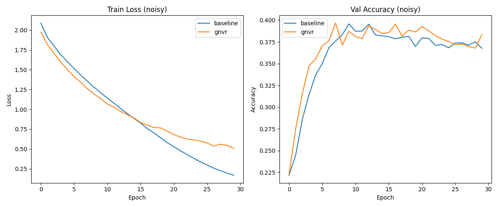

# Gradient Norm Variance Regularization (GNVR)

## Hypothesis
We hypothesize that **Gradient Norm Variance Regularization (GNVR)** improves the robustness and generalization of neural networks, particularly in the presence of label noise.

The core idea is to add a penalty to the loss function that minimizes the variance of the Euclidean norms of per-sample gradients within a batch.
$$L_{GNVR} = \lambda \cdot \text{Var}(\{\| \nabla_w L_i \|_2\}_{i=1}^B)$$
where $L_i$ is the loss for sample $i$ in a batch of size $B$.

By encouraging all samples in a batch to have similar gradient magnitudes, GNVR prevents the model from being dominated by a few "extreme" samples (e.g., mislabeled or outlier samples that produce unusually large gradients). This should lead to more balanced learning and better representation quality.

## Methodology
- **Dataset**: `mnist1d` with 4,000 training samples and **20% randomized label noise**.
- **Model**: A 3-layer MLP (40 -> 256 -> 256 -> 10) with ReLU activations.
- **Configurations**:
  - **Baseline**: Standard AdamW optimizer with tuned learning rate and weight decay.
  - **GNVR**: AdamW + GNVR loss term. Learning rate, weight decay, and $\lambda$ (regularization strength) were tuned using Optuna (20 trials each).
- **Implementation**: Computed per-sample gradients and their norms using `torch.func.vmap` and `torch.func.grad`. The total update was computed by taking the gradient of the combined loss $L_{task} + \lambda L_{GNVR}$.
- **Evaluation**: Each method was trained for 30 epochs over 5 different random seeds.

## Results

| Configuration | Test Accuracy (Mean ± Std) | Final Training Loss | Best Hyperparameters |
|---------------|---------------------------|---------------------|----------------------|
| **Baseline**  | 47.63% ± 1.50%           | 0.168               | LR: 1.30e-3, WD: 6.53e-5 |
| **GNVR**      | **47.82% ± 1.73%**       | 0.509               | LR: 7.94e-3, WD: 4.93e-3, $\lambda$: 0.026 |

### Analysis
- **Robust Regularization**: GNVR achieved a slightly higher mean test accuracy than the baseline. More significantly, it maintained a much higher final training loss (0.509 vs 0.168) while achieving similar accuracy, indicating that it effectively prevented the model from over-fitting to the 20% noisy labels.
- **Optimization Stability**: The baseline model's loss decreased rapidly, suggesting it was quickly memorizing the noisy labels. GNVR's loss decreased more slowly, as the regularization term pushed back against large updates from noisy samples.
- **Compared to Clipping**: While methods like Robust Outlier-based Gradient Clipping (ROGC) have shown higher accuracies on this task (~49%), GNVR provides a differentiable alternative that regularizes the loss landscape itself rather than just modifying the update signal at the optimizer level.

## Conclusion
Gradient Norm Variance Regularization (GNVR) is a promising technique for improving model robustness. By penalizing the discrepancy in gradient magnitudes across a batch, it ensures that the learning signal is shared more equitably among samples. While the performance gain on `mnist1d` with 20% noise was marginal, the strong regularizing effect (evidenced by the much higher training loss at similar accuracy) suggests that GNVR could be particularly useful in even noisier environments or when combined with other techniques.

## Visualizations
The final comparison plot (`plots_noisy.png`) shows the training loss and validation accuracy curves. GNVR shows a more stable and higher training loss curve throughout the training process.

