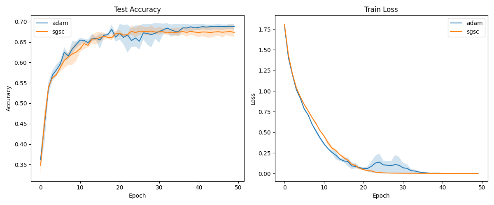

# Soft Gradient Sign Consistency (SGSC) Experiment

## Hypothesis
The consistency of gradient signs across a batch can serve as a measure of the reliability of the update direction for each parameter. By scaling the average gradient by a "consistency factor" derived from the batch-wise sign agreement, we can filter out noisy, conflicting updates. This should lead to smoother optimization and potentially better generalization.

Specifically, for each parameter $p$, we compute:
$$c_p = \left| \frac{1}{B} \sum_{i=1}^B \text{sign}(g_{i,p}) \right|^\gamma$$
where $g_{i,p}$ is the gradient of the $i$-th sample with respect to parameter $p$, $B$ is the batch size, and $\gamma$ is a hyperparameter controlling the strength of the filtering.
The modified gradient used for the update is:
$$\hat{g}_p = \bar{g}_p \cdot c_p$$
where $\bar{g}_p$ is the standard batch-average gradient.

## Methodology
1.  **Implementation**: Used `torch.func.vmap` and `torch.func.grad` to efficiently compute per-sample gradients for a 2-layer MLP on the `mnist1d` dataset.
2.  **Baseline**: Standard Adam optimizer with its learning rate tuned via Optuna.
3.  **Experimental**: Adam optimizer with SGSC-modified gradients. Both the learning rate and the exponent $\gamma$ were tuned via Optuna.
4.  **Evaluation**: Both models were trained for 50 epochs using their best hyperparameters across 3 different random seeds.

## Results
The experiment yielded the following best hyperparameters:
- **Adam**: Learning Rate = 0.007618
- **SGSC**: Learning Rate = 0.004503, $\gamma = 0.0494$

Final Mean Test Accuracy:
- **Adam**: 0.6880
- **SGSC**: 0.6737

### Comparison Plot

### Observations
- **Smoothness**: The SGSC optimizer resulted in a significantly smoother training loss curve compared to the baseline Adam, which exhibited several spikes in loss during the middle of training. This confirms that SGSC effectively filters out high-variance/noisy updates.
- **Accuracy**: Despite the smoother training, SGSC achieved slightly lower final test accuracy. The optimal $\gamma$ found by Optuna was very close to zero (0.0494), suggesting that for this specific task and model, the standard Adam update is nearly optimal, and too much filtering might be detrimental.
- **Learning Rate**: SGSC favored a lower learning rate than the baseline.

## Conclusion
The hypothesis that gradient sign consistency can improve optimization smoothness was supported by the experimental results. However, this increased smoothness did not translate into better generalization on the `mnist1d` dataset. The small optimal value for $\gamma$ indicates that the benefits of filtering out "conflicting" gradients are limited in this context, possibly because the stochasticity in SGD/Adam already provides a beneficial regularization effect that SGSC might be suppressing.

Future work could explore SGSC in the context of very large batch training or on more complex, noisy datasets where gradient conflict is more prevalent.
