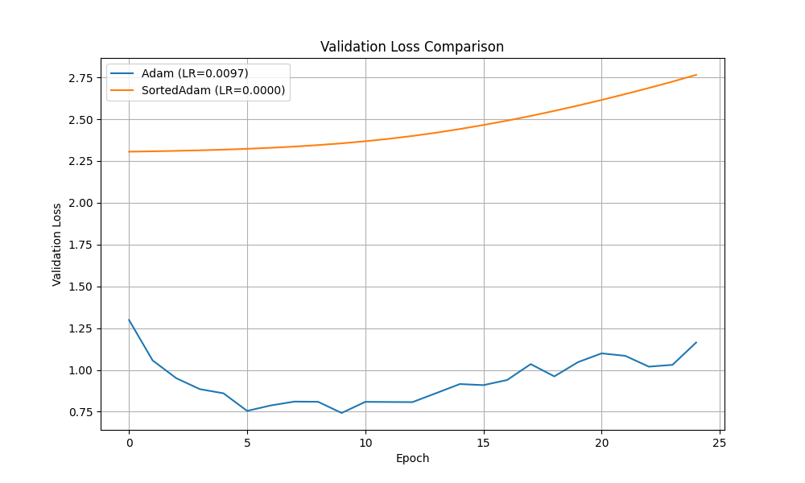

# Gradient Sorting Optimizer Experiment

This experiment investigates the hypothesis that the *distribution* of gradient values, rather than their specific assignment to individual parameters, contains the most crucial information for learning.

## Hypothesis

By sorting the gradients within each parameter tensor before they are processed by a base optimizer (like Adam), we can create a more stable and position-invariant update signal. This could potentially improve convergence by presenting the optimizer with a canonical representation of the gradient distribution at each step, forcing it to learn from the magnitudes of updates rather than noisy, specific gradient-parameter pairings.

To test this, a `SortedGradientOptimizer` was implemented. It acts as a wrapper around a base optimizer (Adam in this case) and, at each step, sorts the gradients within each parameter tensor before passing them to the base optimizer.

## Methodology

1.  **Optimizer:** A `SortedGradientOptimizer` was created as a wrapper for `torch.optim.Adam`.
2.  **Model:** A standard Multi-Layer Perceptron (MLP) was used for classification.
3.  **Dataset:** The `mnist1d` dataset was used for training and validation.
4.  **Comparison:** The performance of `SortedGradientOptimizer(Adam)` was benchmarked against a standard `Adam` optimizer.
5.  **Fairness:** To ensure a fair comparison, the learning rate for both optimizers was tuned using Optuna over 15 trials. Both models were trained from the same initial random weights. The final comparison was run for 25 epochs using the best-found learning rates.

## Results

The experiment ran to completion, and the results clearly contradict the initial hypothesis. The standard Adam optimizer significantly outperformed the `SortedGradientOptimizer`.

-   **Best Learning Rate (Adam):** 0.009722
-   **Best Learning Rate (SortedAdam):** 0.000011
-   **Final Validation Loss (Adam):** 1.1640
-   **Final Validation Loss (SortedAdam):** 2.7652

The validation loss curves are shown below:

## Conclusion

The hypothesis that the sorted distribution of gradients is a sufficient signal for learning is **disproven**. The results strongly indicate that the spatial correspondence between a gradient and its associated parameter is fundamental to the learning process. By removing this correspondence through sorting, the optimizer loses the specific directional information needed to update weights effectively, leading to significantly worse performance. The very low optimal learning rate for the sorted optimizer also suggests it struggled to find any stable learning direction.
