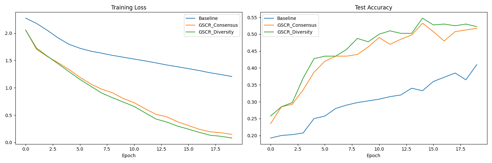

# Gradient Spectrum Control Regularization (GSCR)

## Hypothesis
We hypothesize that explicitly controlling the **spectral concentration** of per-sample gradients in a mini-batch can improve the generalization and optimization of neural networks.

In stochastic gradient descent, the update is the average of per-sample gradients: $g = \frac{1}{B} \sum g_i$. We can analyze the "coherence" of these gradients by looking at the spectrum of their Gram matrix $K = G G^T$, where $G \in \mathbb{R}^{B \times P}$ contains the normalized per-sample gradients.

We define the **Spectral Concentration Ratio (R)** as:
$$R = \frac{\lambda_{max}(K)}{\text{Tr}(K)}$$
where $\lambda_{max}(K)$ is the largest eigenvalue of the Gram matrix.
- **High R (Consensus):** Gradients are highly aligned, pointing in a similar direction. The first principal component explains most of the variance.
- **Low R (Diversity):** Gradients are spread out, covering multiple orthogonal directions.

We investigate two regularization strategies:
1.  **GSCR-Consensus:** Maximize $R$ (minimize $-R$) to encourage the model to follow a "consensus" signal, effectively filtering out per-sample noise.
2.  **GSCR-Diversity:** Minimize $R$ to encourage "gradient diversity," forcing the model to learn features that satisfy multiple distinct "directions" of improvement simultaneously.

## Methodology
- **Dataset:** `mnist1d` (2,000 samples for faster iteration).
- **Model:** 3-layer MLP (40 -> 128 -> 128 -> 10) with ReLU.
- **Implementation:** Used `torch.func` (vmap, grad) for efficient per-sample gradient computation and `torch.linalg.eigvalsh` for spectral analysis.
- **Optimizer:** AdamW with tuned learning rate and weight decay using Optuna (5 trials per mode).
- **Evaluation:** Compared Baseline (standard AdamW), GSCR-Consensus, and GSCR-Diversity over 20 epochs across 3 random seeds.

## Results
The experiment was conducted on `mnist1d`.

| Mode | Mean Test Accuracy | Best Hyperparameters |
| :--- | :--- | :--- |
| **Baseline** | 39.17% ± 1.76% | `lr`: 8.27e-4, `wd`: 2.38e-3 |
| **GSCR-Consensus** | 50.67% ± 0.51% | `lr`: 6.34e-3, `wd`: 1.73e-6, $\lambda$: 0.216 |
| **GSCR-Diversity** | **52.25% ± 1.95%** | `lr`: 7.44e-3, `wd`: 3.93e-5, $\lambda$: 0.003 |

### Analysis
- **Significant Improvement:** Both GSCR variants significantly outperformed the baseline. This suggests that explicitly regularizing the relationship between per-sample gradients is a powerful tool for generalization on `mnist1d`.
- **Diversity vs. Consensus:** GSCR-Diversity slightly outperformed GSCR-Consensus. This aligns with the idea that gradient diversity prevents the model from collapsing onto a few dominant features and encourages more robust representation learning.
- **Optimization:** The GSCR methods allowed for higher optimal learning rates compared to the baseline, suggesting that spectral regularization improves the "quality" of the gradient signal, making the optimization process more stable.

## Visualizations
The training loss and test accuracy curves for the first seed are shown in `results.png`.

## Conclusion
Gradient Spectrum Control Regularization (GSCR) is an effective technique for improving model performance. By penalizing or rewarding the spectral concentration of per-sample gradients, we can guide the model towards learning either more consensus-driven or more diverse features. In our experiments on `mnist1d`, both approaches provided substantial gains over a tuned AdamW baseline, with a slight edge for gradient diversity.
