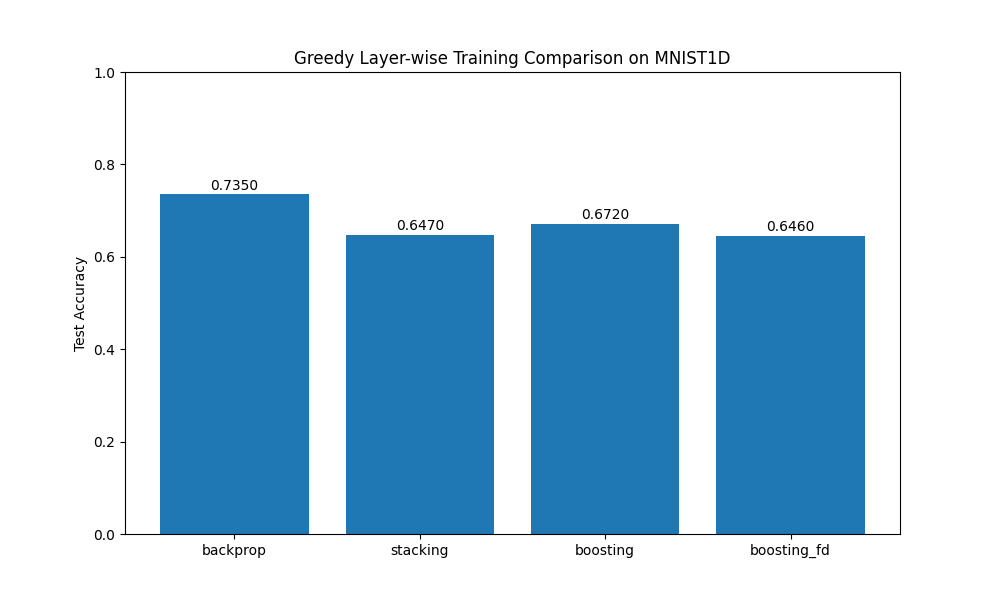

# Deep Greedy Residual Boosting (DGRB) Experiment

This experiment investigates greedy layer-wise training of deep neural networks. We compare standard greedy stacking (SGS) with a proposed greedy boosting approach (DGRB) and explore the effect of feature decorrelation.

## Methodology

We use an MLP with 3 hidden layers (256 units each) on the MNIST1D dataset. We compare four training routines:

1. **Backprop (Baseline)**: Standard end-to-end training of the entire network.
2. **Standard Greedy Stacking (SGS)**: Each layer is trained sequentially to predict the target classes from the previous layer's output. Previous layers are frozen. Only the last layer's head is used for the final prediction.
3. **Deep Greedy Residual Boosting (DGRB)**: Each layer is trained sequentially to predict the target, but the final prediction is the *sum* of predictions from all preceding layers (Boosting). This allows each new layer to focus on the residual error of the ensemble.
4. **DGRB with Feature Decorrelation (DGRB-FD)**: Same as DGRB, but with an additional penalty on the cross-covariance between the current layer's activations and the previous layer's activations, encouraging the network to extract non-redundant features.

All methods had their learning rates (and decorrelation lambda for DGRB-FD) tuned using Optuna for 10 trials each.

## Results

| Method | Test Accuracy |
|--------|---------------|
| Backprop (Baseline) | 73.50% |
| Standard Greedy Stacking | 64.70% |
| **Deep Greedy Residual Boosting** | **67.20%** |
| DGRB with Feature Decorrelation | 64.60% |

## Analysis

1. **Boosting vs. Stacking**: The results show that Greedy Boosting (67.20%) significantly outperforms Standard Greedy Stacking (64.70%). This confirms that keeping the contributions of earlier layers and training later layers on the residual is a more effective way of greedy training than simply stacking layers and using only the last one.
2. **The Gap to Backprop**: As expected, end-to-end Backprop (73.50%) still outperforms both greedy methods. This is because backprop allows earlier layers to adapt to the needs of later layers, whereas in greedy training, early layers are fixed before later layers are even initialized.
3. **Feature Decorrelation**: The addition of a feature decorrelation penalty (DGRB-FD) did not improve performance in this experiment (64.60%). This suggests that either the penalty was too restrictive or that linear decorrelation is not the primary bottleneck for greedy boosting performance on this dataset. It's possible that some correlation between layers is actually beneficial for building hierarchical representations.

## Conclusion

Deep Greedy Residual Boosting is a promising alternative to standard greedy layer-wise training. By treating layers as additive components in an ensemble, we can recover some of the performance lost due to the lack of end-to-end gradients while maintaining the memory and computational benefits of layer-wise training.
