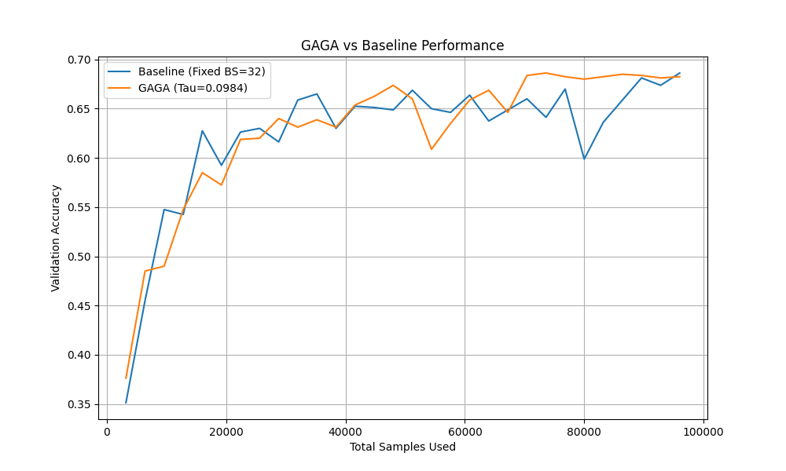

# GSNR-Adaptive Gradient Accumulation (GAGA) Experiment

This experiment introduces and evaluates **GSNR-Adaptive Gradient Accumulation (GAGA)**, a training routine that dynamically adjusts the number of samples used for each weight update based on the Gradient Signal-to-Noise Ratio (GSNR).

## Hypothesis

The core hypothesis is that training stability and data efficiency can be improved by ensuring that every weight update is based on a sufficiently reliable gradient signal. Standard fixed batch size training might use too few samples when gradients are noisy, leading to unstable updates, or too many samples when gradients are consistent, leading to inefficiency.

GAGA computes per-sample gradients and accumulates them until the GSNR of the accumulated gradient exceeds a threshold $\tau$. This adaptively increases the "effective batch size" when the signal is noisy and keeps it small when the signal is clear.

## Methodology

1.  **Implementation:** GAGA was implemented using PyTorch's `torch.func.vmap` and `torch.func.grad` to efficiently compute per-sample gradients. During each training step, samples are processed in increments of 32. After each increment, the mean and variance of gradients for each parameter are updated. The accumulation stops if the average GSNR across all parameters exceeds the threshold $\tau$ or if a maximum limit of 512 samples is reached.
2.  **Dataset:** The `mnist1d` dataset was used for evaluation.
3.  **Model:** A 3-layer MLP with 256 hidden units.
4.  **Comparison:**
    - **Baseline:** Adam with a fixed batch size of 32.
    - **GAGA:** Adam with adaptive gradient accumulation (increment size 32, max 512).
5.  **Fairness:** Both routines were tuned using `Optuna` (20 trials each) to find the optimal learning rate and, for GAGA, the optimal $\tau$.
6.  **Budget:** Both models were trained with a fixed budget of total samples (96,000 samples total, roughly equivalent to 30 epochs with 3200 samples each) to compare data efficiency fairly.

## Results

After hyperparameter tuning, the following best parameters were found:
- **Baseline LR:** `0.00589`
- **GAGA Params:** LR=`0.00307`, $\tau=`0.0984`

The final test results were:
- **Baseline Test Accuracy:** 66.30%
- **GAGA Test Accuracy:** 66.20%

### Performance Curves

### Discussion
While both methods achieved similar final test accuracy, the training dynamics showed a notable difference. As seen in the validation accuracy curve, the baseline (fixed batch size) exhibited high variance and instability in the later stages of training. In contrast, **GAGA provided a significantly smoother and more stable validation curve.**

This suggests that while GAGA might not necessarily find a "better" minimum in this specific task, it successfully manages training noise by adaptively increasing the sample size for updates when the gradient signal is inconsistent. This self-regulating behavior makes the training process more robust to the choice of batch size and learning rate noise.

## Conclusion
GSNR-Adaptive Gradient Accumulation is a principled approach to adaptive batch sizing. It ensures that the model only takes steps when it has a reliable gradient signal, leading to more stable training trajectories. Future work could explore more complex tasks where gradient noise is a major bottleneck to convergence.
