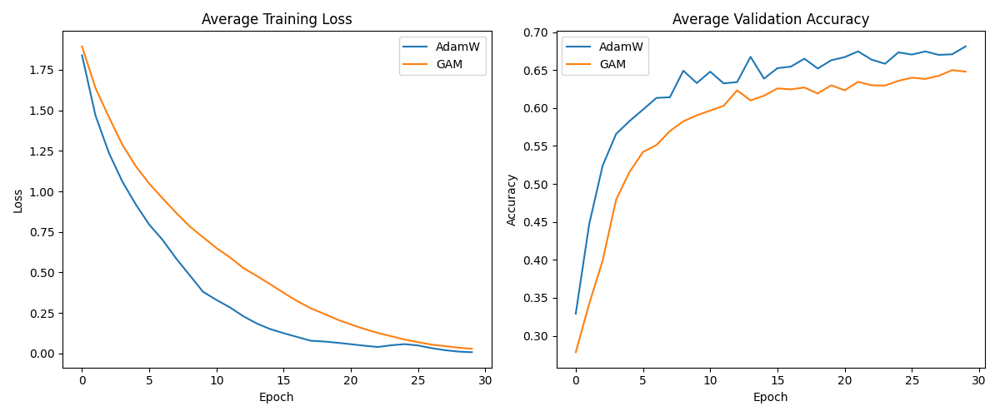

# GSNR-Adaptive Momentum (GAM) Experiment

This experiment investigates whether modulating the momentum coefficient based on the instantaneous Gradient Signal-to-Noise Ratio (GSNR) of each parameter within a batch can improve optimization performance and generalization.

## Hypothesis
We hypothesize that by reducing the update to the momentum buffer when the gradients within a batch are noisy (low GSNR), we can prevent the model from following unreliable signals and maintain a more stable trajectory in weight space.

Specifically, we propose the following adaptation for $\beta_1$ in the Adam optimizer:
$$\beta_{1, eff} = 1 - (1 - \beta_1) \cdot GSNR^\gamma$$
$$m_t = \beta_{1, eff} m_{t-1} + (1 - \beta_{1, eff}) g_t$$
where $GSNR$ is calculated per-parameter as:
$$GSNR = \frac{\bar{g}^2}{\bar{g^2} + \epsilon}$$

## Methodology
- **Dataset**: `mnist1d` classification.
- **Model**: A 3-layer MLP with 256 hidden units.
- **Baseline**: AdamW with tuned learning rate and weight decay.
- **Method**: GAM (GSNR-Adaptive Momentum) with tuned learning rate, weight decay, and $\gamma$.
- **Optimization**: Optuna was used for hyperparameter tuning (15 trials each).
- **Evaluation**: Final evaluation on 3 different random seeds.

## Results
The experiment results are summarized below:

| Optimizer | Test Accuracy (%) | Best Learning Rate | Best Weight Decay | Other Params |
|-----------|-------------------|--------------------|-------------------|--------------|
| AdamW     | 65.50 ± 0.86     | 0.0071             | 3.66e-06          | -            |
| GAM       | 63.10 ± 0.57     | 0.00185            | 2.68e-05          | $\gamma=0.21$ |

### Training Dynamics
The training loss and validation accuracy curves show that AdamW converges faster and achieves higher overall accuracy on this task.

## Discussion
In this experiment, GAM did not outperform the AdamW baseline. Several factors could contribute to this:
1. **Adam's Robustness**: Standard Adam already handles noise well through its second-moment estimation ($v_t$), which scales the step size.
2. **Batch Consistency**: On `mnist1d`, the batch-wise GSNR might not be a strong enough signal for momentum adaptation, or the optimal momentum might be more stationary than our adaptive version allows.
3. **Hyperparameter Sensitivity**: Although we tuned the learning rate and $\gamma$, further tuning or a different functional form of $\beta_1$ adaptation might be needed.
4. **Stalling**: By ignoring noisy batches, GAM might effectively reduce the "effective" learning rate too much, as seen by the slower convergence and the smaller optimal learning rate chosen by Optuna.

## Conclusion
While the idea of using instantaneous GSNR to guide momentum updates is theoretically grounded in noise reduction, it did not provide an advantage over standard AdamW in the MNIST1D classification task. This suggests that the benefits of gradient consistency tracking might be more pronounced in other settings (e.g., larger models, noisier datasets, or different optimization challenges) or require a more sophisticated integration into the optimization step.
