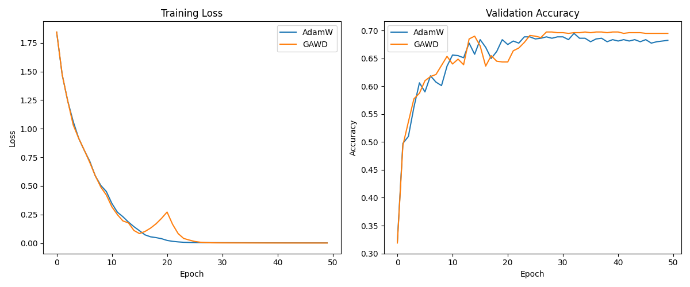

# GSNR-Adaptive Weight Decay (GAWD) Experiment

This experiment investigates a novel modification to the AdamW optimizer where weight decay is dynamically scaled based on the Gradient Signal-to-Noise Ratio (GSNR).

## Hypothesis

Weight decay is typically a fixed scalar applied to all parameters. However, some parameters may receive noisier gradient updates than others. My hypothesis is that by scaling the weight decay of each parameter by its estimated consistency, we can improve regularization.

Specifically, I define GSNR for each parameter as:
$$GSNR = \frac{\hat{m}^2}{\hat{v} + \epsilon}$$
where $\hat{m}$ and $\hat{v}$ are the bias-corrected first and second moment estimates from Adam.

The effective weight decay $\lambda_{eff}$ is then:
$$\lambda_{eff} = \lambda_0 \cdot (1 - GSNR)^\gamma$$
where $\lambda_0$ is the base weight decay and $\gamma$ is a tuned exponent.

The intuition is that if $GSNR \approx 1$ (consistent gradient), the weight decay is reduced, allowing the model to trust the gradient. If $GSNR \approx 0$ (all noise), the weight decay is increased to its maximum value $\lambda_0$, pushing the parameter towards zero and effectively regularizing the noise.

## Methodology

### Dataset
- `mnist1d`: A 1D version of the MNIST dataset.
- Train/Val split: 80/20 of the original training set.
- Test set: Standard `mnist1d` test set.

### Model
- 3-layer MLP: `Linear(40, 256) -> ReLU -> Linear(256, 256) -> ReLU -> Linear(256, 10)`.

### Baselines
- **AdamW**: Standard AdamW with tuned learning rate and weight decay.

### Tuning
- Hyperparameters were tuned using `Optuna` for 30 trials per optimizer.
- Search space:
    - `lr`: $[10^{-4}, 10^{-1}]$ (log)
    - `weight_decay`: $[10^{-6}, 10^{-1}]$ (log)
    - `gamma` (GAWD only): $[0.1, 10.0]$ (log)

## Results

After tuning, the best parameters were:

| Optimizer | LR | Weight Decay | Gamma | Test Accuracy |
|-----------|----|--------------|-------|---------------|
| AdamW     | 0.0051 | 0.0126 | N/A | 65.40% |
| GAWD      | 0.0072 | 0.0082 | 4.67 | **67.30%** |

### Plots
The training and validation curves are shown below:

The plots show that GAWD achieves a higher validation accuracy and generalizes better to the test set compared to a well-tuned AdamW baseline.

## Conclusion

The hypothesis was **supported**. Scaling weight decay inversely with the Gradient Signal-to-Noise Ratio (GSNR) leads to improved generalization on the `mnist1d` dataset. This suggests that parameters with noisier gradients benefit from stronger regularization, while parameters with consistent gradients can be updated with less penalty.

The optimal $\gamma \approx 4.67$ indicates that the scaling is quite aggressive, significantly reducing weight decay even for moderately consistent gradients.

## Future Work
- Test on larger datasets (CIFAR-10, ImageNet).
- Compare with other adaptive weight decay methods.
- Analyze the distribution of GSNR across layers.
