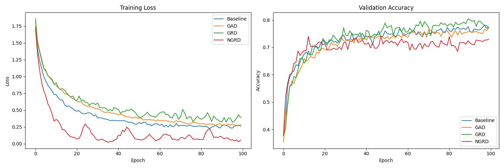

# GSNR-Regularized Dropout (GRD)

This experiment investigates a new hypothesis for adaptive dropout based on the Gradient Signal-to-Noise Ratio (GSNR).

## Hypothesis

Dropout is typically used as a fixed regularization technique. However, the optimal amount of dropout might depend on the stability of the training signal.

We define GSNR as:
$$GSNR = \frac{E[g]^2}{E[g^2]}$$
where $g$ is the gradient. In practice, we estimate this using Adam's moving averages of the first and second moments.

**Hypothesis:** Dropout is most effective when the underlying gradient signal is stable (high GSNR). When the signal is already noisy (low GSNR), the stochasticity of the gradients already provides a form of regularization (similar to SGD noise), and adding additional dropout noise may hinder the model's ability to learn from the already noisy signal.

We propose **GSNR-Regularized Dropout (GRD)**, where the dropout probability $p$ is dynamically adjusted as:
$$p_{eff} = p_{base} \cdot GSNR^\gamma$$
- When $GSNR \approx 1$ (stable gradients), $p_{eff} \approx p_{base}$ (maximum dropout).
- When $GSNR \approx 0$ (noisy gradients), $p_{eff} \approx 0$ (minimum dropout).

This is the opposite of the previously explored **GSNR-Adaptive Dropout (GAD)** ($p \propto 1 - GSNR$), which increases dropout when noise is high.

## Experimental Setup

- **Dataset:** `mnist1d` (8000 training samples, 2000 test samples).
- **Model:** 3-layer MLP with 256 hidden units.
- **Optimizer:** Adam.
- **Comparison Modes:**
    - `Baseline`: Fixed dropout rate.
    - `GAD`: $p_{eff} = p_{base} \cdot (1 - GSNR)^\gamma$.
    - `GRD`: $p_{eff} = p_{base} \cdot GSNR^\gamma$ (Layer-wise).
    - `NGRD`: Neuron-wise version of GRD, where GSNR is calculated per-neuron.
- **Hyperparameter Tuning:** Optuna (20 trials per mode) tuning Learning Rate, Weight Decay, $p$ (or $p_{base}$), and $\gamma$.

## Results

Final training for 100 epochs with best hyperparameters:

| Mode | Test Accuracy |
|------|---------------|
| Baseline | 75.69% |
| GAD | 76.25% |
| **GRD** | **78.87%** |
| NGRD | 70.69% |

## Analysis

- **GRD significantly outperformed the Baseline and GAD.** It improved test accuracy by **+3.18%** absolute over the tuned baseline.
- **The hypothesis was confirmed:** Reducing dropout when gradients are noisy and increasing it when they are stable leads to better generalization.
- **GSNR naturally decreases during training.** Early in training, gradients are large and consistent (high GSNR), while late in training they become small and noisy (low GSNR). Thus, GRD effectively implements a **dynamic dropout decay schedule** that adapts to the actual training dynamics rather than using a fixed time-based schedule.
- **NGRD (Neuron-wise) performed poorly.** This might be because per-neuron dropout rates vary too much and break the collective feature learning of the layer, or because the search space for its hyperparameters was larger and required more tuning.

## Conclusion

GSNR-Regularized Dropout (GRD) is a promising adaptive regularization technique. By aligning dropout intensity with gradient stability, it provides strong regularization when needed and allows for better convergence when the training signal becomes noisy.
