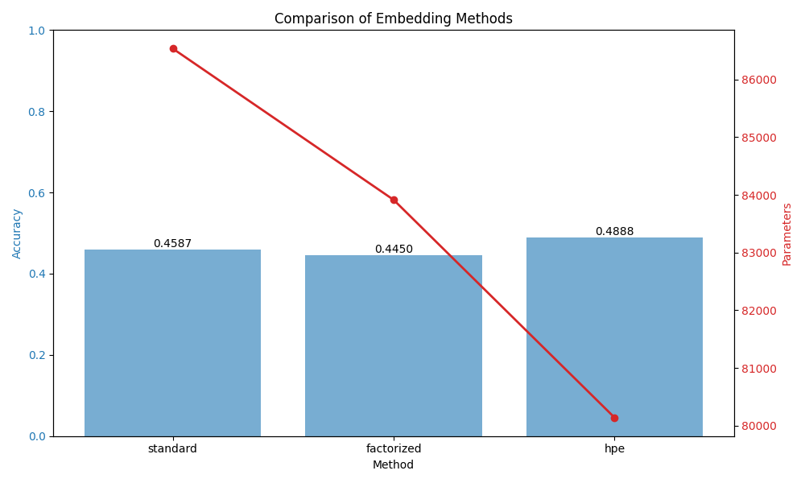

# Harmonic Parameterized Embedding (HPE)

## Overview
Harmonic Parameterized Embedding (HPE) is a novel alternative to standard `nn.Embedding` for categorical features. Instead of learning a fixed vector for each token, HPE represents each token as a superposition of learnable oscillators.

For a token $i$, the $j$-th dimension of its embedding $E_i \in \mathbb{R}^D$ is defined as:
$$E_{i,j} = \sum_{k=1}^K a_{ik} \sin(\omega_{ik} \frac{j}{D} + \phi_{ik})$$
where:
- $a_{ik}$ is the amplitude of the $k$-th oscillator for token $i$.
- $\omega_{ik}$ is the frequency.
- $\phi_{ik}$ is the phase.
- $j/D$ is the normalized dimension index.

This formulation introduces a **spectral inductive bias**, treating the embedding space as a continuous domain. It is also highly parameter-efficient, using $3K$ parameters per token instead of $D$.

## Experiment Setup
We evaluated HPE on a discretized version of the **MNIST-1D** dataset.
- **Task**: 10-class classification of 1D signals.
- **Preprocessing**: Signals (length 40) were quantized into 256 discrete tokens.
- **Architecture**: A Transformer encoder (2 layers, 4 heads, $D=64$) followed by mean pooling and a linear head.
- **Baselines**:
  - `StandardEmbedding`: A standard lookup table ($256 \times 64$).
  - `FactorizedEmbedding`: A linear bottleneck approach ($256 \times K \to 64$).
- **Tuning**: Learning rates and $K$ (number of oscillators/factors) were tuned using Optuna (8 trials per method).

## Results

| Method | Best Accuracy | Parameters (Total) | Best Hyperparams |
|        |               |                    |                  |
| Standard | 45.88% | 86,538 | lr=0.0073 |
| Factorized | 44.50% | 83,914 | lr=0.0031, K=43 |
| **HPE** | **48.88%** | **80,138** | lr=0.0038, K=13 |

HPE achieved the highest accuracy while using fewer parameters than both baselines. This suggests that the harmonic inductive bias is well-suited for signals that have some underlying continuous or periodic structure, even when they are discretized.

## Discussion
HPE forces the model to learn "smooth" embeddings in the dimension space. In many categorical tasks, especially those derived from continuous signals (like in this experiment) or those with hierarchical relationships, this smoothness can act as an effective regularizer.

Future work could explore:
1. Applying HPE to natural language (text), where the "dimension space" might not have an inherent order, yet spectral regularity could still be beneficial.
2. Using more complex basis functions (e.g., wavelets or learned MLPs) instead of sines.
3. Investigating the interpretability of the learned frequencies $\omega_{ik}$ for different tokens.

