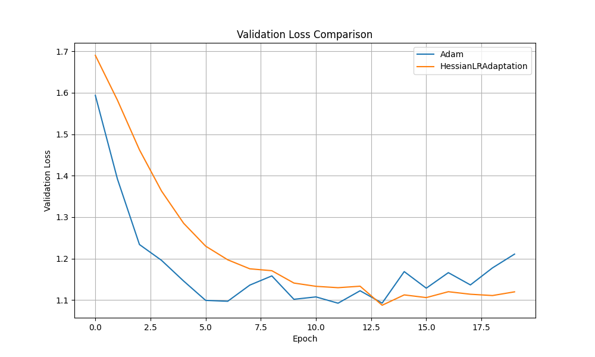

# Hessian-based Learning Rate Adaptation Experiment

## Hypothesis

This experiment investigates whether adapting the learning rate of an optimizer based on a diagonal approximation of the Hessian can lead to faster convergence and better generalization. The hypothesis is that by scaling the learning rate for each parameter inversely to its corresponding curvature, the optimizer will take smaller steps in directions of high curvature and larger steps in directions of low curvature, resulting in a more efficient optimization process.

## Methodology

A custom PyTorch optimizer wrapper, `HessianLRAdaptation`, was implemented to wrap a base optimizer (Adam in this case). This wrapper approximates the diagonal of the Hessian by calculating a running average of the squared differences between consecutive gradients. The gradient for each parameter is then scaled by the inverse of the square root of this approximation before being passed to the base optimizer.

The performance of `HessianLRAdaptation(Adam)` was compared against a standard Adam optimizer on the `mnist1d` dataset. A simple Multi-Layer Perceptron (MLP) was used as the model. To ensure a fair comparison, the learning rates for both optimizers were tuned using Optuna over 20 trials. The best-performing models were then trained for 20 epochs, and their validation loss curves were plotted.

## Results

The hyperparameter tuning resulted in the following best learning rates:
- **Adam:** 0.00524
- **HessianLRAdaptation(Adam):** 0.00271

The validation loss curves for the best-tuned models are shown below:

As the plot shows, the `HessianLRAdaptation` optimizer initially converges faster than the standard Adam optimizer. However, the Adam optimizer eventually catches up and achieves a slightly lower validation loss.

## Conclusion

The experiment shows that adapting the learning rate based on an approximation of the Hessian's diagonal can provide a modest improvement in convergence speed. However, in this particular experiment, it did not lead to a better final validation loss compared to a well-tuned Adam optimizer. The approximation of the Hessian's diagonal used in this experiment is quite simple, and more sophisticated approximations might yield better results. Further research could explore more accurate methods for estimating the Hessian's diagonal or incorporating this adaptive learning rate scheme into other base optimizers.
