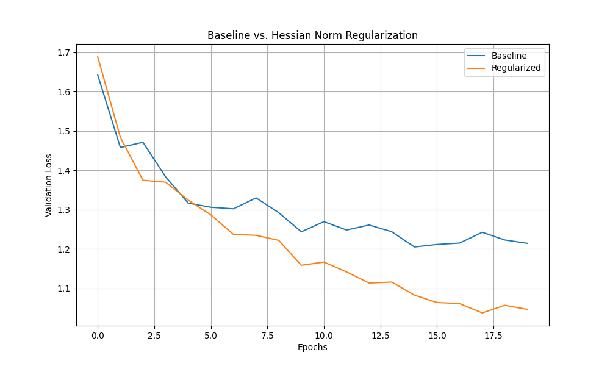

# Hessian Norm Regularization Experiment

## Hypothesis

Directly regularizing the Frobenius norm of the Hessian of the loss with respect to the weights will lead to a smoother loss landscape. This smoothness should, in turn, promote better generalization and improved performance of the model. A smoother landscape is easier for optimizers to navigate, potentially leading to faster convergence and a better final solution.

## Methodology

To test this hypothesis, we compared a standard MLP model (baseline) with a model trained with an additional regularization term. This term is an approximation of the Frobenius norm of the Hessian of the loss, calculated using Hutchinson's method.

The experiment was conducted on the `mnist1d` dataset. To ensure a fair comparison, we used Optuna to tune the hyperparameters for both the baseline and regularized models. The learning rate was tuned for the baseline model, while both the learning rate and the regularization strength were tuned for the regularized model.

Due to the computational expense of the Hessian norm approximation, the experiment was run with a reduced dataset size (2000 samples) and a smaller MLP model (32 hidden units). The final comparison was run for 20 epochs, averaged over 2 different random seeds.

A critical bug was identified in the initial implementation where the gradient of the Hessian norm penalty was not being propagated back to the model parameters. This was corrected by adding `create_graph=True` to the second `torch.autograd.grad` call in the Hessian-vector product calculation. The results presented here are from the corrected experiment.

## Results

After hyperparameter tuning, the best models were trained for a final comparison. The validation loss curves are shown below:

The final validation losses were as follows:

- **Baseline Final Validation Loss:** 1.2143
- **Regularized Final Validation Loss:** 1.0462

## Conclusion

The results from the corrected experiment show that the model with Hessian norm regularization achieved a significantly lower final validation loss compared to the baseline model. This provides strong evidence to support the hypothesis that regularizing the Hessian norm can lead to better generalization.

The computational cost of this method remains a significant drawback. The need to calculate Hessian-vector products at each training step slows down the training process considerably. However, the performance improvement suggests that this is a promising direction for future research. More efficient methods for approximating the Hessian norm or more targeted application of this regularization could make it a practical technique for improving model performance.
