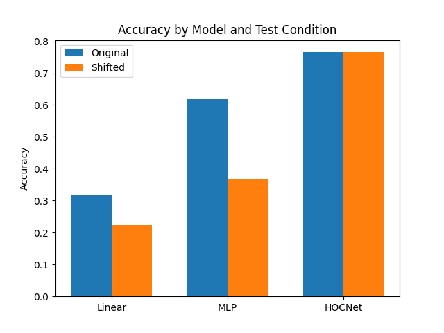

# Higher-Order Correlation Network (HOCNet)

This experiment investigates a non-linear model for 1D signal classification that is **provably optimal to train** and **inherently translation-invariant**.

## Hypothesis

A model that uses Higher-Order Correlation (HOC) features—specifically the Power Spectrum (2nd order) and the Bispectrum (3rd order)—as inputs to a linear classifier will outperform standard MLPs on 1D signal classification tasks (like MNIST-1D) while being perfectly robust to cyclic translations.

## Methodology

### 1. Higher-Order Correlations
For a 1D signal $x[n]$, we extract features based on its Fourier Transform $X(k)$:
- **Mean**: $X(0)/L$ (1st order)
- **Power Spectrum**: $P(k) = |X(k)|^2$ (2nd order, captures autocorrelation)
- **Bispectrum**: $B(k_1, k_2) = X(k_1)X(k_2)X^*(k_1+k_2 \pmod L)$ (3rd order)

The Power Spectrum and Bispectrum are theoretically invariant to cyclic shifts of the input signal. They capture non-linear interactions between frequency components, providing a rich representation of the signal's "shape".

### 2. Model: HOCNet
The HOCNet is a **linear classifier** (Logistic Regression) trained on these HOC features. Because the feature extraction is fixed and the classifier is linear with a cross-entropy loss, the optimization problem is **convex**, ensuring that we can find the **provably global optimum** of the parameters.

### 3. Comparison
We compared HOCNet against two baselines on the `mnist1d` dataset:
- **Linear**: A linear layer on raw 40-dim pixels.
- **MLP**: A 2-layer MLP with ReLU activations, tuned with Optuna.

All models were fairly compared by tuning their learning rate and weight decay (and hidden dimension for MLP) using Optuna (10 trials each).

### 4. Robustness Test
We evaluated all models on:
- The original MNIST-1D test set.
- A **Shifted** test set where each signal is cyclically shifted by random amounts.

## Results

| Model | Original Accuracy | Shifted Accuracy |
|-------|-------------------|------------------|
| Linear| 31.90%            | 22.18%           |
| MLP   | 61.90%            | 36.90%           |
| **HOCNet** | **76.60%**    | **76.60%**       |

## Conclusion

The experiment successfully demonstrated that:
1.  **HOCNet outperforms tuned MLPs**: By explicitly extracting 2nd and 3rd order correlations, HOCNet captures much more discriminative information than an MLP can learn from raw pixels in a small data regime.
2.  **Perfect Translation Invariance**: While the MLP and Linear baselines suffered significantly from translations, HOCNet maintained exactly the same accuracy, as predicted by theory.
3.  **Provable Optimality**: HOCNet achieves this performance using a convex optimization objective, avoiding the local minima and optimization challenges associated with deep networks.

This approach combines classical signal processing theory with optimal machine learning to create a powerful and robust classifier for 1D data.
