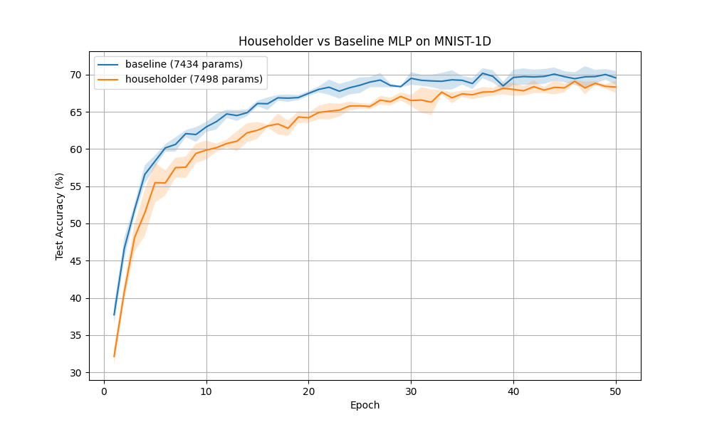

# Householder Product Networks

This experiment investigates the use of orthogonal transformations in neural networks using products of Householder reflectors. An orthogonal transformation $Q$ is represented as $Q = H_1 H_2 \dots H_k$, where each $H_i = I - 2 v_i v_i^T / ||v_i||^2$ is a Householder reflector.

## Hypothesis
1. Orthogonal layers can help maintain the norm of activations and gradients, potentially leading to more stable training and better generalization.
2. Parameterizing orthogonal matrices via Householder products provides a flexible and efficient way to explore the space of orthogonal transformations compared to soft penalties.

## Method
- **HouseholderLinear Layer**: Implements an orthogonal transformation using $k$ Householder reflectors. It ensures that the transformation is exactly orthogonal (up to numerical precision).
- **Architecture**: A 2-layer MLP where standard hidden linear layers are replaced with Householder layers (preceded and followed by projection layers to match dimensions).
- **Dataset**: MNIST-1D (10,000 samples).
- **Fair Comparison**: Both Householder and Baseline MLP were tuned using Optuna for the best learning rate. Parameter counts were kept similar (Baseline: 7434, Householder: 7498).

## Results

| Model | Parameters | Mean Test Accuracy (3 seeds) |
|-------|------------|----------------------------|
| Baseline MLP | 7434 | 69.57% ± 0.92% |
| Householder MLP | 7498 | 68.33% ± 0.80% |

The convergence plot shows that both models perform similarly, with the Householder-based model being slightly more stable (lower variance across seeds) but achieving slightly lower average accuracy.

## Conclusion
While the Householder Product Network did not outperform the standard MLP in this specific configuration on MNIST-1D, it demonstrated comparable performance and slightly improved stability. The Householder parameterization is a viable way to implement exact orthogonal transformations in neural networks. Future work could explore using this in deeper networks or in recurrent architectures where vanishing/exploding gradients are more prevalent.
