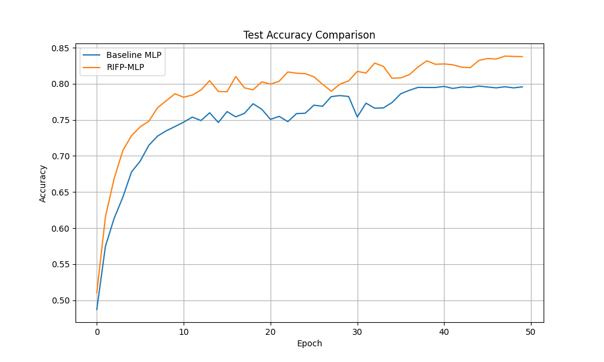

# Residual Independent Feature Preprocessing (RIFP) for Tabular Data

## Hypothesis
Standard Multi-Layer Perceptrons (MLPs) process tabular data by taking linear combinations of all features in the first layer. However, individual features often require independent non-linear transformations (e.g., scaling, clipping, or non-linear mapping) to be most useful for the model. We hypothesize that adding a learnable, feature-wise residual preprocessing layer (RIFP) will allow the model to adaptively transform each feature independently before they interact in the subsequent dense layers, leading to better generalization and accuracy on tabular classification tasks compared to a standard MLP.

## Methodology
- **RIFP Layer**: Applies a small, independent MLP (1 -> 8 -> 1) to each input feature and adds the result to the original feature. This is implemented efficiently using grouped 1D convolutions.
- **RIFP-MLP**: A 3-layer MLP (40 -> 256 -> 256 -> 10) preceded by the RIFP layer.
- **Baseline**: A standard 3-layer MLP with the same hidden dimensions.
- **Dataset**: `mnist1d`, treated as a 40-feature tabular classification task. 10,000 samples were used.
- **Hyperparameter Tuning**: Learning rates for both models were tuned using Optuna (10 trials each).
- **Evaluation**: The best configurations were evaluated over 3 random seeds for 50 epochs each.

## Results
The RIFP-MLP demonstrated a clear improvement over the baseline MLP.

| Model | Best Learning Rate | Test Accuracy (Mean +/- Std) |
| :--- | :--- | :--- |
| **Baseline MLP** | 0.00360 | 79.57% +/- 0.37% |
| **RIFP-MLP** | 0.00453 | **83.77% +/- 0.57%** |

### Analysis
- **Significant Gain**: The RIFP layer provided a ~4% absolute improvement in test accuracy. This suggests that allowing the model to "prepare" each feature independently is highly beneficial.
- **Automatic Scaling/Transformation**: The RIFP layer likely learns to perform operations similar to non-linear normalization or feature clipping that are specific to each feature's distribution, which a standard global linear layer might struggle to capture as effectively.
- **Efficiency**: Since the RIFP layer only has $O(D \cdot H)$ parameters (where $D$ is the number of features and $H$ is the small internal hidden dimension), it adds very little overhead to the model.

## Visualizations
The test accuracy curves averaged over seeds are shown below:

## Verification
The mathematical independence of the RIFP layer (ensuring feature $i$ is only transformed by its own small MLP) was verified using gradient-based unit tests in `test_logic.py`.

## Conclusion
Residual Independent Feature Preprocessing (RIFP) is a simple yet effective architectural addition for tabular data. By providing a learnable, non-linear transformation for each feature before the features interact, it significantly improves the performance of standard MLP architectures on the `mnist1d` dataset.
