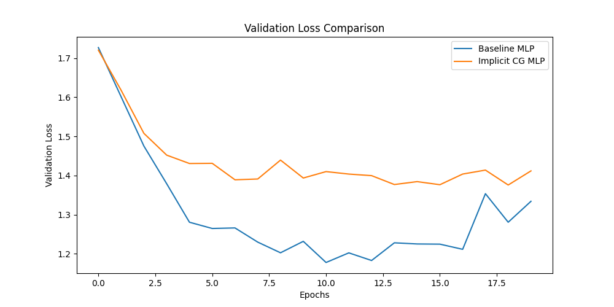

# Implicit CG Layer Experiment

This experiment investigates the use of an "Implicit CG Layer" in a neural network. Instead of a standard matrix multiplication, this layer solves a system of linear equations using the Conjugate Gradient (CG) method.

## Hypothesis

The hypothesis is that using an implicit CG layer could lead to richer, more expressive representations within the network, potentially improving performance on a given task compared to a standard MLP.

## Methodology

A simple MLP with an implicit CG layer was compared against a baseline MLP of similar size. Both models were trained on the `mnist1d` dataset. To ensure a fair comparison, the learning rates for both models were tuned using Optuna over 20 trials. The models were then trained for 20 epochs using their respective optimal learning rates.

The best learning rate for the baseline MLP was found to be approximately `0.00345`.
The best learning rate for the Implicit CG MLP was found to be approximately `0.06918`.

## Results

The validation loss curves for both models are shown below:

As the plot shows, the baseline MLP consistently outperforms the Implicit CG MLP. The Implicit CG MLP's validation loss is higher and more erratic, suggesting that it is not as effective as a standard dense layer for this task.

## Conclusion

The hypothesis that an implicit CG layer would improve performance is not supported by the results of this experiment. The standard MLP architecture proved to be more effective.
