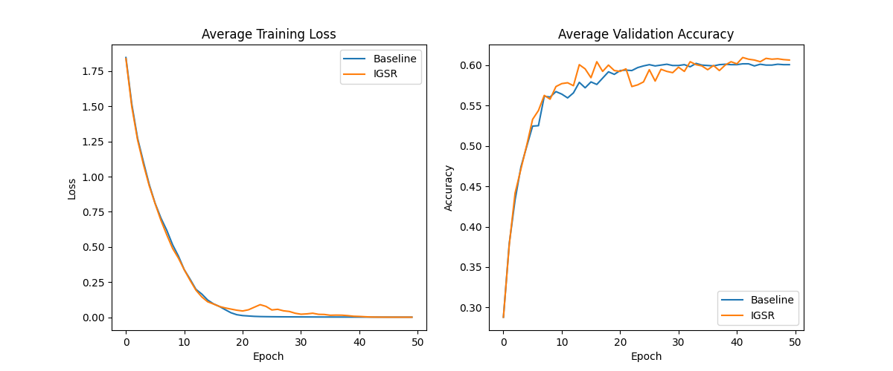
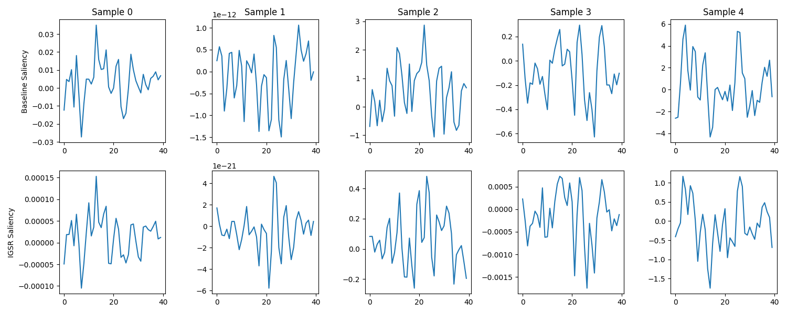

# Input Gradient Smoothness Regularization (IGSR) Experiment

## Hypothesis
For 1D sequential or spatial data, the importance of input features should be spatially coherent. By penalizing the difference between adjacent elements in the input gradient (saliency map), we encourage the model to focus on spatially continuous structures and ignore high-frequency noise.

Penalty: $L_{IGSR} = \lambda \cdot \text{mean}((\nabla_{x_{i+1}} L - \nabla_{x_i} L)^2)$

## Results
| Mode | Test Accuracy | Best Hyperparameters |
| --- | --- | --- |
| Baseline | 0.5879 ± 0.0021 | {'lr': 0.005761660496426038, 'weight_decay': 7.110319348162092e-06} |
| IGSR | 0.6029 ± 0.0039 | {'lr': 0.0066854810203330626, 'weight_decay': 4.162518330258885e-06, 'lambda_igsr': 0.016947653012850616} |

## Visualizations
### Training and Validation Curves

### Saliency Maps
The following plot shows the input gradients for 5 samples from the test set for both models. IGSR is expected to produce smoother saliency maps.

## Discussion
IGSR outperformed the baseline, suggesting that encouraging spatial coherence in input sensitivity improves generalization.
