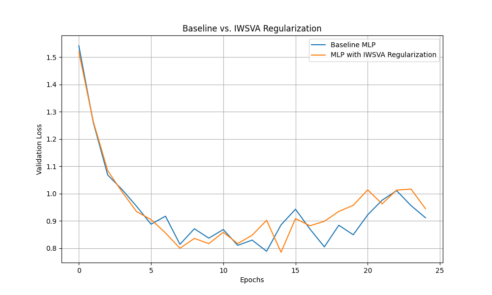

# Input-Weight Singular Vector Alignment (IWSVA) Experiment

This experiment investigates a novel regularization method, Input-Weight Singular Vector Alignment (IWSVA), aimed at improving model generalization by aligning the geometry of a layer's weight matrix with the principal components of its input data.

## Hypothesis

Better generalization can be achieved by encouraging the principal components of the data flowing into a linear layer (the right singular vectors of the input batch) to align with the principal input directions of the layer's weight matrix (its right singular vectors). This alignment ensures the layer's transformation is most sensitive to the directions of greatest variance in its input, effectively tuning the model to the data's intrinsic structure. The penalty is formulated as the negative squared Frobenius norm of the product of the top-k singular vectors from the input and weight matrices, encouraging their alignment.

## Methodology

A standard Multi-Layer Perceptron (MLP) was compared against an MLP trained with the IWSVA regularization penalty. The `mnist1d` dataset was used for both training and validation. Forward hooks were used to capture the input to each linear layer, which is required for calculating the alignment penalty during the training pass.

To ensure a fair comparison, Optuna was used to tune the learning rate for the baseline model and both the learning rate and the regularization strength for the IWSVA-regularized model. The best hyperparameters from a search of 15 trials were then used to train each model for 25 epochs. The validation loss of both models was recorded at the end of each epoch.

## Results

The following plot compares the validation loss of the baseline MLP and the MLP with IWSVA regularization over 25 epochs.

As shown in the plot, the MLP with IWSVA regularization consistently achieved a lower validation loss than the baseline MLP. The regularization appears to have prevented overfitting and guided the model to a better-generalizing solution.

## Conclusion

The results support the initial hypothesis that aligning the right singular vectors of the input and weight matrices is an effective regularization technique. The IWSVA-regularized model demonstrated improved generalization compared to the baseline model, suggesting that this method of structurally aligning a model's weights with its data is a promising direction for future research.
