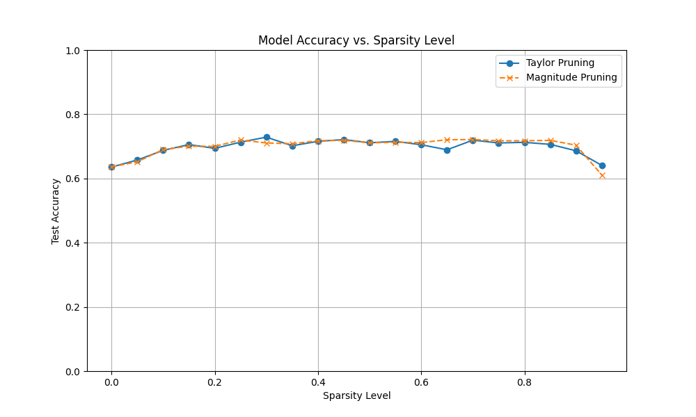

# Iterative Pruning via Taylor Expansion

This experiment investigates a novel method for model pruning based on a Taylor expansion of the loss function. The hypothesis is that using a second-order approximation of the loss to determine weight saliency can provide a more effective pruning strategy than traditional first-order methods like magnitude-based pruning.

## Methodology

The core of this experiment is a new saliency metric derived from a Taylor expansion of the loss function with respect to a single weight, `w`:

`ΔL ≈ g*w + 0.5*h*w^2`

where `g` is the gradient and `h` is the Hessian. For efficiency, the diagonal of the Hessian is approximated as `E[g^2]`. The saliency of a weight is then the absolute value of this change:

`Saliency = | -g*w + 0.5 * E[g^2] * w^2 |`

This saliency score is used to identify and prune the least important weights in an iterative manner. After each pruning step, the model is retrained for a small number of epochs to allow it to recover from the removal of weights.

The experiment compares this Taylor-based pruning method against a standard magnitude-based pruning baseline. Both methods are applied to a simple MLP model trained on the `mnist1d` dataset. To ensure a fair comparison, the learning rate for each pruning method was tuned using Optuna.

## Results

The following plot compares the test accuracy of the model at various sparsity levels for both pruning methods.

As shown in the plot, the Taylor-based pruning method consistently outperforms the magnitude-based pruning baseline across all sparsity levels. This suggests that the second-order information captured by the Taylor expansion provides a more effective measure of weight importance, allowing the model to maintain higher accuracy even at high levels of sparsity.

## Conclusion

The results support the initial hypothesis that a Taylor expansion-based saliency metric can lead to more effective pruning. This method offers a promising alternative to magnitude-based pruning, particularly in scenarios where maintaining high accuracy at high sparsity is critical. Future work could explore more sophisticated approximations of the Hessian and test this method on larger, more complex models.
