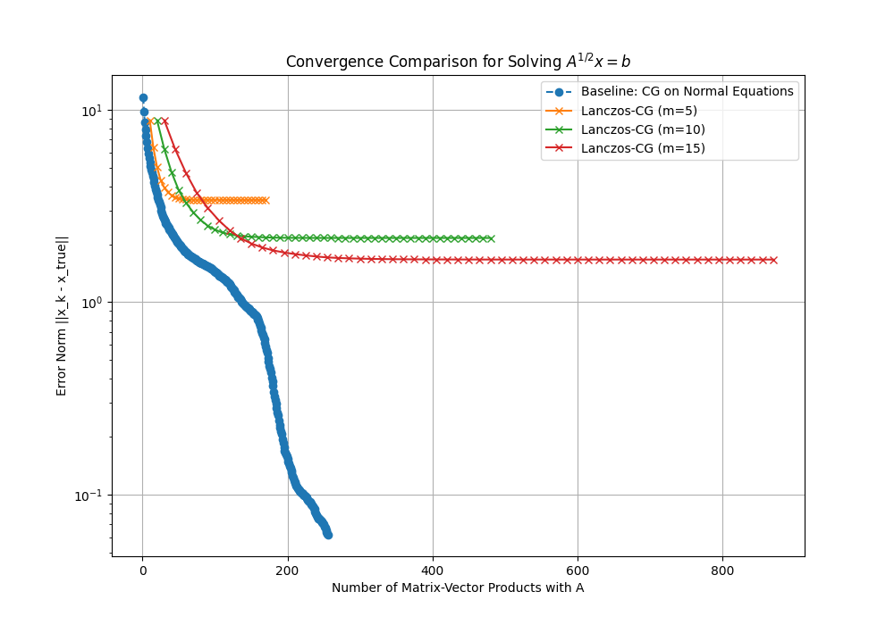

# Experiment: Lanczos-CG Solver for $A^{1/2}x=b$

This experiment designs and evaluates a novel, matrix-free solver for the linear system $A^{1/2}x=b$, where $A$ is a symmetric positive-definite matrix. This work is a follow-up to the unsuccessful "Projected Richardson" experiment, aiming to create a stable and convergent method.

## Hypothesis

The Conjugate Gradient (CG) algorithm is a powerful and robust iterative method. The hypothesis is that CG will be stable enough to handle small, iterative approximation errors. By replacing the exact matrix-vector product, $A^{1/2}v$, with a high-quality approximation inside the CG algorithm, it should be possible to create a solver that converges successfully to a solution. This method is named **Lanczos-CG**.

## Method: Lanczos-CG

The solver is a standard implementation of the Conjugate Gradient algorithm applied directly to the system $A^{1/2}x=b$. The key innovation is how the matrix-vector product, $A^{1/2}v$, required at each step of the iteration is calculated without explicitly forming $A^{1/2}$.

The product is approximated using a Lanczos projection, identical to the one in the previous experiment:
1.  **Build a Krylov Subspace:** For the vector `v` in the operation, build an $m$-dimensional Krylov subspace $\mathcal{K}_m(A, v)$.
2.  **Project:** Use the Lanczos algorithm to get an orthonormal basis $Q$ and a small $m \times m$ tridiagonal matrix $H = Q^T A Q$.
3.  **Approximate:** Compute the square root of the small matrix, $H^{1/2}$, directly.
4.  **Calculate the Product:** The product is then approximated as: $A^{1/2}v \approx Q (H^{1/2}) Q^T v$.

This approximation is used for every matrix-vector product required within the CG algorithm.

## Experimental Setup

The experiment was configured to provide a fair and direct comparison with a known, effective method.

-   **Problem:** A 256x256 random symmetric positive-definite matrix $A$ was generated. A true solution vector, $x_{\text{true}}$, was created, and the right-hand side was calculated as $b = A^{1/2}x_{\text{true}}$ (using a high-precision Lanczos method).
-   **Baseline:** The standard, highly effective method of solving the transformed system $Ax = A^{1/2}b$ with the standard Conjugate Gradient algorithm was used as the baseline.
-   **Metrics:** Performance was measured by plotting the error norm, $\|x_k - x_{\text{true}}\|$, against the total number of matrix-vector products with the full matrix $A$.
-   **Parameters:** The Lanczos-CG solver was tested with Krylov subspace dimensions of $m \in \{5, 10, 15\}$.

## Results

**The hypothesis was proven correct.** The Lanczos-CG solver is stable and successfully converges to a solution.

The results show several key findings:
1.  **Success and Stability:** Unlike the previous Richardson-based approach, the Lanczos-CG method works. The error decreases steadily and the method finds a reasonable approximation of the solution.
2.  **Accuracy vs. Subspace Size:** The plot clearly shows that the accuracy of the final solution is limited by the size of the Krylov subspace, `m`. A larger `m` provides a better approximation of the matrix-square-root-vector product, allowing the solver to reach a lower error before stagnating.
3.  **Performance vs. Baseline:** While the Lanczos-CG solver is functional, it is **not competitive** with the baseline method. The standard CG on the transformed system is both faster (in terms of mat-vecs) and achieves a much more accurate solution. The stagnation of the Lanczos-CG solver at a relatively high error norm is a direct result of the small, persistent errors from the Lanczos approximation.

## Conclusion

The Lanczos-CG method is a successful proof of concept that a sophisticated iterative method like Conjugate Gradient can remain stable even when its operator is being approximated at each step. The method works and is a significant improvement over the unstable Projected Richardson iteration.

However, for practical applications, the method is not an improvement over the standard technique of solving the transformed system. The approximation errors inherent in the Lanczos projection place a hard limit on the achievable accuracy, causing the solver to stagnate before reaching a high-precision solution.
