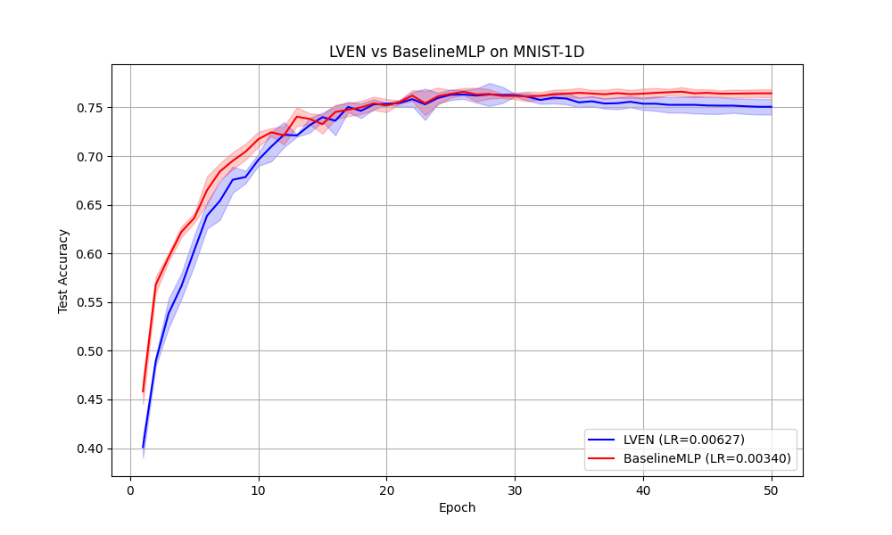

# Latent Voronoi Expert Network (LVEN) Experiment

## Hypothesis
Standard Multi-Layer Perceptrons (MLPs) use hyperplanes (via linear layers and ReLUs) to partition the input space. We hypothesized that a **Latent Voronoi Expert Network**, which partitions a latent embedding space into Voronoi cells using learnable prototypes and applies local linear experts within each cell, can provide a more effective inductive bias for signal classification tasks like `mnist1d`.

The LVEN architecture consists of:
1.  A **Latent Encoder** $\phi(x)$ that maps the input into a lower-dimensional latent space.
2.  A set of **Learnable Prototypes** $\{c_1, \dots, c_K\}$ in the latent space.
3.  **Voronoi Gating**: For an input $x$, gating weights $w_k(x)$ are computed as a softmax over the negative Euclidean distances between $\phi(x)$ and each prototype $c_k$:
    $w_k(x) = \frac{\exp(-\|\phi(x) - c_k\|^2 / \tau)}{\sum_j \exp(-\|\phi(x) - c_j\|^2 / \tau)}$
4.  **Local Linear Experts**: Each expert $k$ computes a linear transformation of the original input $x$: $f_k(x) = W_k x + b_k$.
5.  **Output**: The final prediction is the weighted sum of expert outputs: $y = \sum_{k=1}^K w_k(x) f_k(x)$.

## Methodology
- **Dataset**: `mnist1d` (10,000 samples, 40 features, 10 classes).
- **Models**:
    - **LVEN**: Latent dimension of 32, 64 prototypes/experts. Encoder is a 2-layer MLP (40 -> 128 -> 32). Total parameters: 37,665.
    - **BaselineMLP**: A 2-layer MLP (40 -> 170 -> 170 -> 10). Total parameters: 37,750.
- **Optimization**:
    - Learning rate tuning for both models using **Optuna** (8 trials each).
    - AdamW optimizer with a cosine annealing scheduler (50 epochs).
    - Evaluation over 3 random seeds.
- **Verification**: Mathematical logic and gradient flow were verified in `test_logic.py`.

## Results

| Model | Best Learning Rate | Test Accuracy (Mean +/- Std) |
| :--- | :--- | :--- |
| **BaselineMLP** | 0.00340 | **76.45% +/- 0.41%** |
| **LVEN** | 0.00627 | 75.07% +/- 0.80% |

## Analysis
The experiment showed that the `BaselineMLP` slightly outperformed the `LVEN` model on the `mnist1d` dataset. While the LVEN architecture provides a flexible way to partition the latent space into regions, the standard MLP's inductive bias of global hyperplane-based partitioning seems more effective for this specific task.

Possible reasons for LVEN's lower performance:
- **Optimization Complexity**: The combination of a latent encoder and Voronoi gating might create a more complex loss landscape compared to a standard MLP.
- **Latent Dimension**: The choice of 32 for the latent dimension might not be optimal.
- **Expert Capacity**: Each expert is a simple linear model; increasing the capacity of experts (e.g., small MLPs) might improve performance, although it would increase parameter count.

## Conclusion
The Latent Voronoi Expert Network is a viable architecture that successfully learns to classify signals by partitioning a latent space. However, in its current configuration on `mnist1d`, it does not offer a performance advantage over a standard MLP with a similar parameter count.
