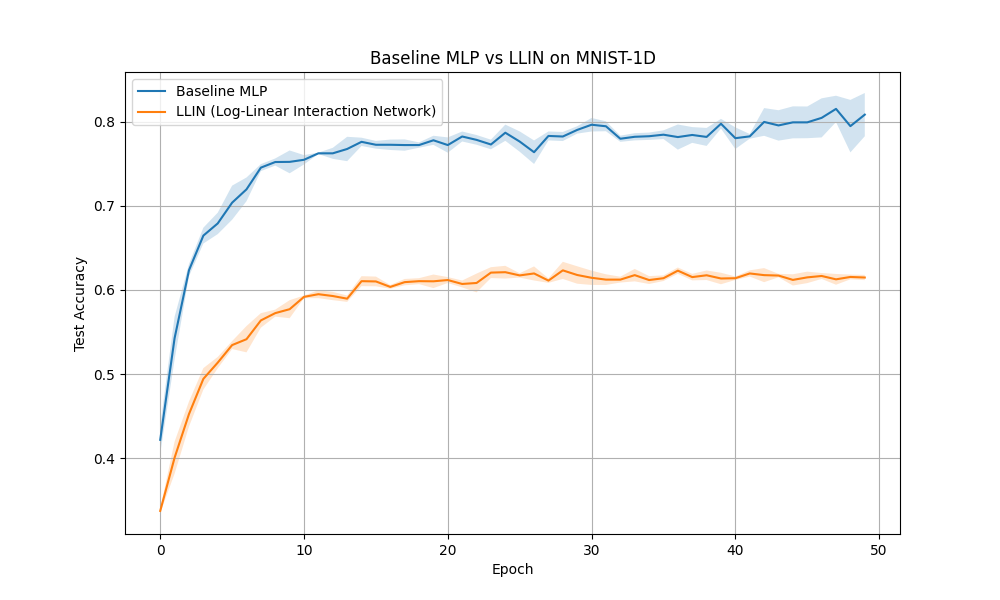

# Log-Linear Interaction Network (LLIN) Experiment

## Hypothesis
We hypothesize that many real-world datasets, including some signals, contain multiplicative relationships between features that are difficult for standard MLPs with additive layers and ReLU activations to capture efficiently. We propose the **Log-Linear Interaction Layer**, which combines standard linear transformations with a parallel log-space path:
$$y = \text{Linear}_{add}(x) + \text{Linear}_{mult}(\exp(W \log(|x| + \epsilon) + b))$$
This architecture should theoretically allow the model to learn product-based interactions (since $\exp(\sum w_i \log x_i) = \prod x_i^{w_i}$) alongside traditional additive features.

## Methodology
- **Model Architectures**:
  - **Baseline MLP**: A standard MLP with Linear layers and ReLU activations.
  - **LLIN**: A network using the proposed `LogLinearInteractionLayer` followed by ReLU.
- **Dataset**: `mnist1d` (10,000 samples).
- **Hyperparameter Tuning**: Both models were tuned using Optuna for 10-15 trials to find optimal learning rate, weight decay, hidden dimension, and number of layers.
- **Evaluation**: The best-performing configurations were trained for 50 epochs across 3 different seeds to ensure robustness.

## Results

| Model | Mean Test Accuracy | Std Dev |
|-------|-------------------|---------|
| Baseline MLP | **80.85%** | 2.57% |
| LLIN | 61.48% | 0.31% |

### Observations
1. **Performance**: The Baseline MLP significantly outperformed the LLIN on the `mnist1d` dataset.
2. **Convergence**: The LLIN showed very stable but lower performance across seeds (Std Dev 0.31% vs 2.57% for Baseline).
3. **Inductive Bias**: The results suggest that for the `mnist1d` dataset, multiplicative interactions are either not prevalent or the current implementation of LLIN introduces optimization challenges (e.g., vanishing/exploding gradients in the log-exp path) that outweigh its representational benefits.
4. **Complexity**: The LLIN's best architecture was found to be shallower (1 layer) compared to the Baseline's best (3 layers), suggesting that the log-linear layer might be harder to stack or requires more careful initialization.

## Conclusion
While the Log-Linear Interaction Network provides a theoretically sound way to incorporate multiplicative interactions into a differentiable framework, it did not provide a benefit for the `mnist1d` task in this configuration. Future work could investigate different epsilon values, gating mechanisms for the multiplicative path, or testing on datasets known to have strong multiplicative components (e.g., physical simulations or certain tabular datasets).
