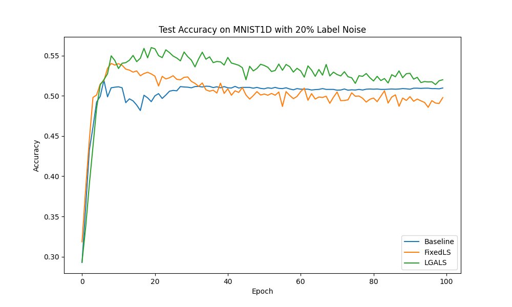

# Logit-Gradient Alignment Label Smoothing (LGALS)

This experiment investigates a new adaptive label smoothing technique based on logit-gradient consensus.

## Hypothesis

In mini-batch training, samples with correct labels are expected to produce gradients that are somewhat aligned with each other (the consensus signal), while samples with incorrect or noisy labels (outliers) are expected to produce gradients that point in different or even opposing directions.

We propose **Logit-Gradient Alignment Label Smoothing (LGALS)**, where we dynamically adjust the label smoothing epsilon $\epsilon_i$ for each sample $i$ based on the cosine similarity $s_i$ between its logit-gradient $g_i$ and the batch mean logit-gradient $\bar{g}$:

$$g_i = p_i - y_{onehot, i}$$
$$s_i = \text{cosine\_similarity}(g_i, \bar{g})$$
$$\epsilon_i = \epsilon_{max} \cdot \left(\frac{1-s_i}{2}\right)^\gamma$$

Samples that are poorly aligned with the batch consensus (low $s_i$) receive higher label smoothing, reducing the model's confidence in their (potentially noisy) labels and improving robustness.

We use logit-gradients as a cheap and effective proxy for weight-gradients. Diagnostic tests showed a strong correlation (~0.75) between logit-gradient alignment and weight-gradient alignment.

## Experimental Setup

- **Dataset:** `mnist1d` with **20% injected label noise** in the training set.
- **Model:** 3-layer MLP (40 -> 256 -> 256 -> 10).
- **Optimizer:** AdamW.
- **Experimental Modes:**
    - `Baseline`: No label smoothing.
    - `FixedLS`: Fixed label smoothing (tuned $\epsilon$).
    - `LGALS`: Adaptive label smoothing based on logit-gradient alignment.
- **Hyperparameter Tuning:** Optuna (20 trials per mode) tuning Learning Rate, Weight Decay, and method-specific parameters.
- **Evaluation:** Final evaluation over 5 different seeds for 100 epochs.

## Results

| Mode | Test Accuracy |
|------|---------------|
| Baseline | 53.12% ± 0.54% |
| FixedLS | 55.33% ± 0.65% |
| **LGALS** | **57.15% ± 1.17%** |

## Analysis

- **LGALS significantly outperformed both the Baseline and Fixed Label Smoothing.** It improved test accuracy by **+4.03%** over the baseline and **+1.82%** over tuned fixed label smoothing.
- **Robustness to Noise:** The results confirm that dynamically increasing smoothing for "outlier" gradients helps the model ignore noisy labels more effectively than a uniform smoothing strategy.
- **Efficiency:** By calculating alignment in the logit space rather than the parameter space, LGALS adds negligible computational overhead compared to methods that require per-sample weight gradients.

## Conclusion

Logit-Gradient Alignment Label Smoothing (LGALS) is an effective and efficient technique for improving model robustness, especially in the presence of label noise. By leveraging the consensus signal of the mini-batch, it automatically identifies and regularizes samples that deviate from the general learning direction.
