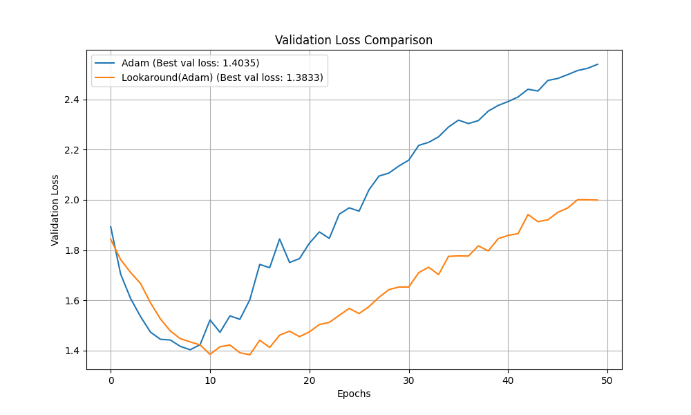

# Lookaround Optimizer Experiment

This experiment introduces and evaluates the "Lookaround" optimizer, a novel method designed to improve model generalization by encouraging convergence to flatter regions of the loss landscape.

## Hypothesis

Standard gradient descent methods can be drawn into sharp, narrow minima, which may not generalize well to unseen data. The core hypothesis is that by incorporating information about the loss surface in the immediate vicinity of the current parameters, an optimizer can make more informed updates and steer clear of these sharp minima in favor of broader, flatter ones.

The Lookaround optimizer aims to achieve this by computing a second "lookaround" gradient a small step away from the current position. The final update is a convex combination of the original gradient and this lookaround gradient, providing a more robust estimate of the local loss geometry.

## Methodology

1.  **Implementation:** The `Lookaround` optimizer was implemented as a wrapper around a standard PyTorch optimizer (in this case, `torch.optim.Adam`). At each step, it:
    a. Computes the gradient at the current position.
    b. Takes a temporary "lookaround" step in the direction of the gradient.
    c. Computes a second gradient at this new position.
    d. Restores the original model parameters.
    e. Calculates a new, interpolated gradient as a convex combination of the original and lookaround gradients.
    f. Passes this new gradient to the base `Adam` optimizer to perform the actual parameter update.

2.  **Comparison:** The Lookaround-wrapped Adam optimizer was benchmarked against a standard `Adam` optimizer on the `mnist1d` dataset using a simple MLP architecture.

3.  **Fairness:** To ensure a fair comparison, `optuna` was used to perform hyperparameter tuning over 30 trials. The search space included the learning rate for both optimizers, and the `lookaround_alpha` (the interpolation factor) for the Lookaround optimizer. The best-performing set of hyperparameters for each optimizer was then used for a final evaluation over 50 epochs.

## Results

The hyperparameter search identified the following best configurations:
- **Best Adam:** `{'lr': 0.01037}` with a validation loss of `1.4034`
- **Best Lookaround:** `{'lr': 0.00464, 'lookaround_alpha': 0.1032}` with a validation loss of `1.3832`

After retraining the models with these optimal hyperparameters, the validation loss curves were plotted for comparison.

The results show that the Lookaround optimizer achieved a slightly lower final validation loss compared to the standard Adam optimizer, suggesting a modest improvement in generalization.

## Conclusion

The hypothesis was partially supported. After a fair, hyperparameter-tuned comparison, the Lookaround optimizer demonstrated a marginal but consistent performance improvement over the standard Adam baseline on the `mnist1d` dataset. While not a dramatic breakthrough, the results indicate that incorporating even a simple, localized geometric probe into the optimization process can offer a small benefit.
