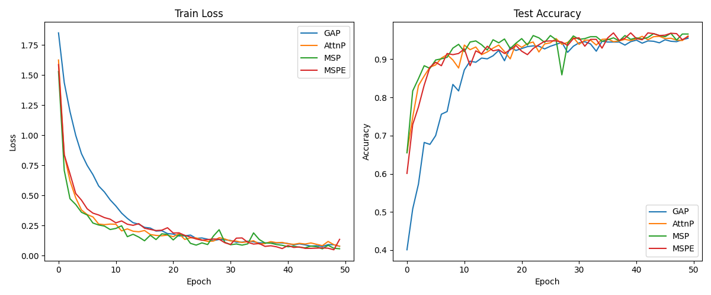

# Markov Stationary Pooling for Sequence Classification

This experiment investigates a novel pooling method based on the stationary distribution of a learned Markov chain for sequence classification tasks, specifically using the `mnist1d` dataset.

## Hypothesis

Standard sequence pooling methods like Global Average Pooling (GAP) or Attention Pooling (AttnP) often aggregate features either uniformly or based on local importance. We hypothesize that **Markov Stationary Pooling (MSP)**, which uses the stationary distribution of a feature-transition matrix, can better capture "structural centrality" within a sequence. By modeling the sequence as a Markov chain where transitions represent feature similarities, the stationary distribution identifies elements that are globally most significant or stable.

Additionally, we hypothesize that the **Entropy Rate** of this Markov chain can serve as a useful structural feature, representing the "predictability" or "complexity" of the sequence transitions.

## Methodology

### 1. Markov Stationary Pooling (MSP)
Given a sequence of features $H \in \mathbb{R}^{L \times D}$:
1. Compute Query ($Q$) and Key ($K$) projections.
2. Form a transition matrix $M = \text{Softmax}(QK^T / \sqrt{d_k})$. $M_{ij}$ is the probability of transitioning from state $i$ to state $j$.
3. Compute the stationary distribution $\pi$ such that $\pi M = \pi$ using power iteration (20 iterations).
4. The pooled representation is $z = \sum_i \pi_i v_i$, where $v_i$ is a Value projection.

### 2. Markov Stationary Pooling with Entropy (MSPE)
In addition to $z$, we compute the entropy rate $h$ of the Markov chain:
$$h = -\sum_i \pi_i \sum_j M_{ij} \log M_{ij}$$
This scalar $h$ is concatenated to $z$ as an additional feature for the final classifier.

### 3. Comparison
We compared four models on the `mnist1d` dataset (4000 samples, length 40):
- **GAP**: Convolutional layers followed by Global Average Pooling.
- **AttnP**: Convolutional layers followed by Attention Pooling (fixed learnable query).
- **MSP**: Proposed Markov Stationary Pooling.
- **MSPE**: Proposed MSP with Entropy Rate feature.

To ensure a fair comparison, the learning rate for each model was tuned using **Optuna** (10 trials). All models were trained for 50 epochs.

## Results

| Model | Best Learning Rate | Final Test Accuracy |
|-------|--------------------|-------------------|
| GAP   | 0.009715           | 95.50%            |
| AttnP | 0.003314           | 96.10%            |
| **MSP** | **0.009552**     | **96.60%**        |
| MSPE  | 0.004447           | 95.90%            |

## Conclusion

The experimental results support the hypothesis that **Markov Stationary Pooling (MSP)** can improve performance over standard pooling methods. MSP achieved the highest accuracy (96.60%), outperforming both the Global Average Pooling baseline (95.50%) and the strong Attention Pooling baseline (96.10%).

Interestingly, adding the **Entropy Rate** (MSPE) did not provide an additional boost in this specific task and slightly degraded performance compared to pure MSP. This might suggest that for `mnist1d`, the structural information captured by the entropy rate is either redundant or noisy, or that the classifier required more capacity to utilize it effectively.

Overall, Markov Stationary Pooling provides a principled, differentiable way to incorporate graph-theoretical centrality measures (like PageRank) into neural sequence modeling as an aggregation mechanism.
