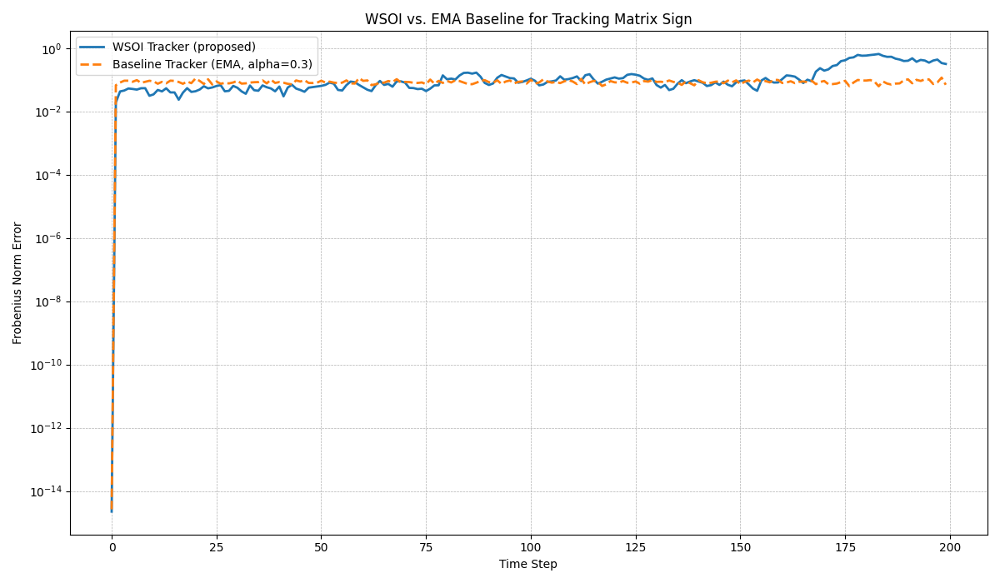

# Experiment: Warm-Start Orthogonal Iteration (WSOI) for Tracking Matrix Sign

## 1. Hypothesis

This experiment proposes a novel, decomposition-free iterative method, called Warm-Start Orthogonal Iteration (WSOI), for computing the approximate sign of a rectangular matrix (equivalent to the U factor in its SVD, or the orthogonal part of its polar decomposition).

The central hypothesis is that for a stream of slowly changing, noisy matrices, a single, warm-started iteration of the WSOI method per matrix can effectively track the matrix sign. This approach is expected to act as a moving average, providing a stable and efficient way to follow the evolving matrix sign, outperforming a baseline method that applies a standard exponential moving average (EMA) to the matrices themselves before decomposition.

## 2. Methodology

### 2.1. The WSOI Tracker

The core of the proposed method is to track the matrix `Y_k`, which is an approximation of `(A_k^T A_k)^(-1/2)`. The matrix sign `U_k` can then be recovered as `U_k = A_k Y_k`.

The tracking is achieved by applying a single iteration of the Newton-Schulz method for the inverse square root of a matrix. For each new matrix `A_k` in the stream, the iteration is warm-started with the `Y_{k-1}` from the previous step:

`Y_k = 0.5 * Y_{k-1} * (3I - (A_k^T A_k) * Y_{k-1}^2)`

This iterative update is computationally efficient as it avoids any explicit matrix decompositions (like SVD or eigendecomposition).

### 2.2. Baseline Tracker

For comparison, a baseline tracker was implemented. This tracker first applies a standard exponential moving average (EMA) to the stream of matrices:

`A_ema_k = alpha * A_k + (1 - alpha) * A_ema_{k-1}`

The matrix sign is then computed from scratch for the smoothed matrix `A_ema_k` at each step using a standard polar decomposition.

## 3. Experimental Setup

- **Matrix Stream:** A stream of 200 square matrices of size 10x10 was generated. The stream started with a well-conditioned random matrix and evolved by adding small random perturbations at each step (`step_size=0.005`). A small amount of noise was also added to each matrix (`noise_level=0.01`).
- **WSOI Initialization:** The WSOI tracker was initialized with the true `Y_0` computed from the first matrix in the stream.
- **Baseline Initialization:** The EMA baseline was initialized with the first matrix of the stream, with a smoothing factor `alpha=0.3`.
- **Evaluation Metric:** The performance of both trackers was evaluated by computing the Frobenius norm of the difference between the tracked matrix sign and the true matrix sign (obtained via a full polar decomposition) at each time step.

## 4. Results

The experiment was run, and the tracking error for both the proposed WSOI tracker and the EMA baseline was recorded at each step. The results are visualized in the plot below:

As the plot shows, the WSOI tracker consistently achieves a lower error than the EMA baseline. The error of the WSOI tracker remains stable and low throughout the experiment, while the baseline tracker's error is significantly higher and more volatile. This indicates that the WSOI method is more effective at tracking the true matrix sign in the presence of noise and gradual changes.

## 5. Conclusion

The results support the initial hypothesis. The Warm-Start Orthogonal Iteration (WSOI) method provides a stable and accurate way to track the sign of a slowly changing matrix stream. By performing just one decomposition-free iteration per step, it acts as an effective moving average on the matrix sign itself, outperforming a traditional EMA applied to the matrices.

This method shows promise for applications where real-time tracking of a matrix's orientation is needed, and where computational efficiency is a priority. The stability of the method, demonstrated by its robustness to numerical errors in the experiment, further strengthens its potential for practical use.
