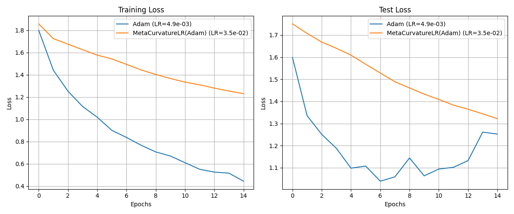

# Meta-Curvature Learning Rate Experiment

This experiment investigates a novel meta-learning approach for dynamically adapting the learning rate of an optimizer based on the curvature of the loss landscape.

## Hypothesis

An optimizer that adapts its learning rate based on the local curvature of the loss landscape will converge faster and achieve better performance than an optimizer with a fixed learning rate. The core idea is to take smaller steps in regions of high curvature (steep, complex areas) to avoid overshooting local minima, and larger steps in regions of low curvature (flat areas) to accelerate progress.

## Methodology

1.  **`MetaCurvatureLR` Optimizer:** A new PyTorch optimizer wrapper, `MetaCurvatureLR`, was implemented in `optimizer.py`. This wrapper takes a base optimizer (e.g., Adam) as input.
2.  **Curvature Estimation:** The optimizer estimates the curvature of the loss landscape by calculating the trace of the Hessian matrix. This is done efficiently using Hutchinson's method, which approximates the trace by averaging `v^T * H * v` over random vectors `v`.
3.  **Learning Rate Adaptation:** The learning rate of the base optimizer is updated at a fixed frequency (`update_freq`) according to the rule:
    `new_lr = initial_lr / (1 + alpha * trace_H)`
    where `trace_H` is the estimated Hessian trace, and `alpha` is a scaling hyperparameter.
4.  **Comparison Setup:** The `MetaCurvatureLR(Adam)` optimizer was compared against a standard `Adam` optimizer. Both optimizers were used to train an identical MLP model on the `mnist1d` dataset.
5.  **Hyperparameter Tuning:** To ensure a fair comparison, the learning rate for both optimizers was tuned using Optuna over 20 trials. The objective was to minimize the validation loss after 5 epochs. The best learning rates found were then used for the final comparison over 15 epochs.

## Results

After tuning the learning rates, the experiment showed that the `MetaCurvatureLR(Adam)` optimizer still performed worse than the baseline Adam optimizer, although the difference was less pronounced than in the initial, untuned comparison. The standard Adam optimizer converged to a lower test loss than the meta-optimizer.

As seen in the plot, the standard Adam optimizer with a tuned learning rate achieves a lower final test loss compared to the `MetaCurvatureLR` optimizer with its tuned learning rate.

## Conclusion

The hypothesis was not supported by the experimental results, even after a fairer comparison with tuned learning rates. The proposed method of adapting the learning rate based on the Hessian trace proved to be ineffective.

Several factors could contribute to this failure:

1.  **Noisy Curvature Estimates:** The Hessian trace estimate from Hutchinson's method can be very noisy, which could lead to erratic and suboptimal learning rate adjustments.
2.  **Oversimplified Update Rule:** The learning rate update formula is simple and may not correctly capture the complex relationship between curvature and the optimal step size.
3.  **Implementation Details:** The process of calculating higher-order derivatives for the Hessian trace estimation is computationally intensive and can be unstable.

In summary, while the idea of adapting the learning rate to the loss landscape's curvature is appealing, this particular implementation was unsuccessful.
