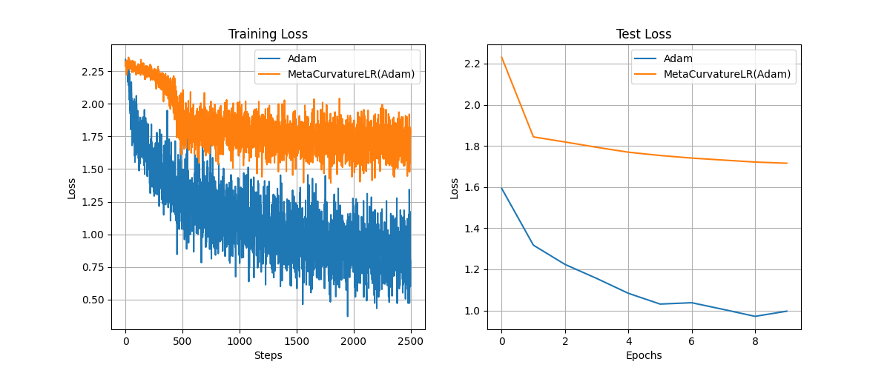

# Meta-Curvature Learning Rate Experiment

This experiment investigates a novel meta-learning approach for dynamically adapting the learning rate of an optimizer based on the curvature of the loss landscape.

## Hypothesis

An optimizer that adapts its learning rate based on the local curvature of the loss landscape will converge faster and achieve better performance than an optimizer with a fixed learning rate. The core idea is to take smaller steps in regions of high curvature (steep, complex areas) to avoid overshooting local minima, and larger steps in regions of low curvature (flat areas) to accelerate progress.

## Methodology

1.  **`MetaCurvatureLR` Optimizer:** A new PyTorch optimizer wrapper, `MetaCurvatureLR`, was implemented in `optimizer.py`. This wrapper takes a base optimizer (e.g., Adam) as input.
2.  **Curvature Estimation:** The optimizer estimates the curvature of the loss landscape by calculating the trace of the Hessian matrix. This is done efficiently using Hutchinson's method, which approximates the trace by averaging `v^T * H * v` over random vectors `v`.
3.  **Learning Rate Adaptation:** The learning rate of the base optimizer is updated at a fixed frequency (`update_freq`) according to the rule:
    `new_lr = initial_lr / (1 + alpha * trace_H)`
    where `trace_H` is the estimated Hessian trace, and `alpha` is a scaling hyperparameter.
4.  **Comparison Setup:** The `MetaCurvatureLR(Adam)` optimizer was compared against a standard `Adam` optimizer. Both optimizers were used to train an identical MLP model on the `mnist1d` dataset. To ensure a fair comparison, both models were initialized with the same random weights, and the initial learning rate for both was set to `1e-3`.

## Results

The experiment showed that the `MetaCurvatureLR(Adam)` optimizer performed significantly worse than the baseline Adam optimizer. The training and test losses were consistently higher, and the convergence was much slower.

As seen in the plot, the standard Adam optimizer achieves a steadily decreasing loss, while the `MetaCurvatureLR` optimizer struggles to make progress and maintains a high loss throughout the training process.

## Conclusion

The initial hypothesis was not supported by the experimental results. The proposed method of adapting the learning rate based on the Hessian trace proved to be ineffective and detrimental to the training process.

Several factors could contribute to this failure:

1.  **Noisy Curvature Estimates:** The Hessian trace estimate from Hutchinson's method can be very noisy, especially with a low number of samples (in this experiment, `n_hutchinson_samples=1`). This noise could lead to erratic and suboptimal learning rate adjustments.
2.  **Oversimplified Update Rule:** The learning rate update formula is simple and may not correctly capture the complex relationship between curvature and the optimal step size. The hyperparameters (`alpha`, `update_freq`) were also not tuned, and their initial values may have been poor.
3.  **Implementation Details:** The process of calculating higher-order derivatives for the Hessian trace estimation is computationally intensive and can be unstable. While the code ran, PyTorch issued a warning about potential memory leaks when using `loss.backward(create_graph=True)`, which was necessary for this approach.

In summary, while the idea of adapting the learning rate to the loss landscape's curvature is appealing, this particular implementation was unsuccessful. Future work could explore more robust estimation techniques or more sophisticated learning rate adaptation rules.
